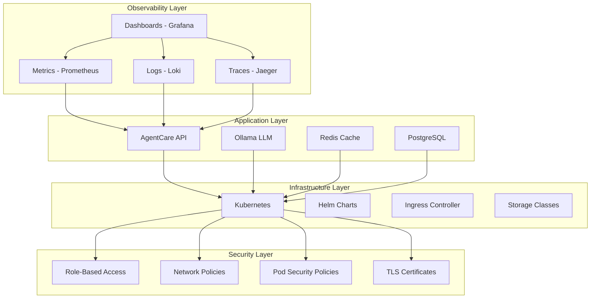
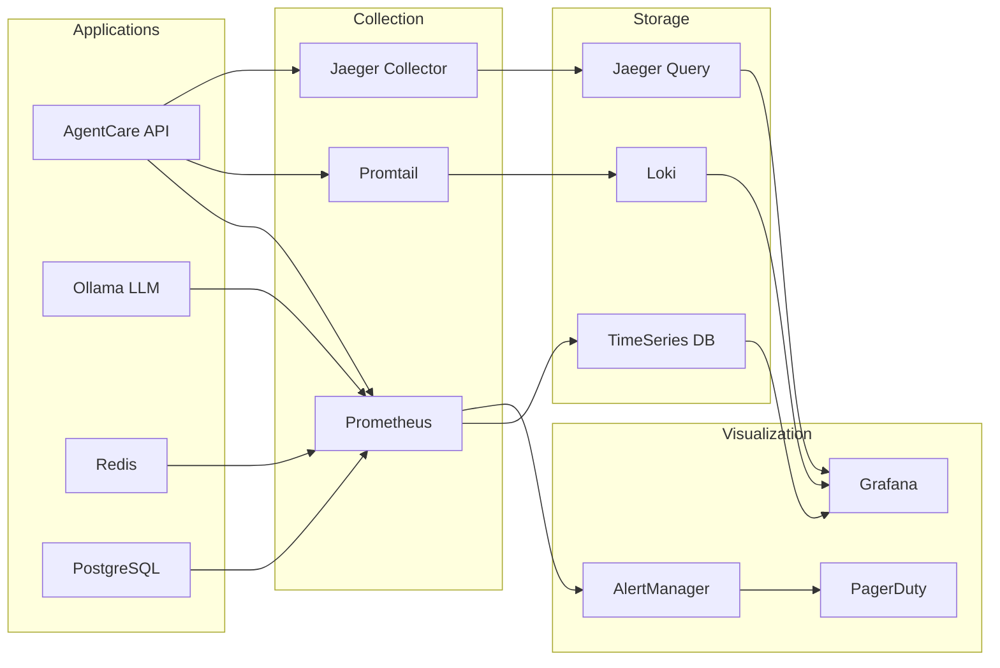
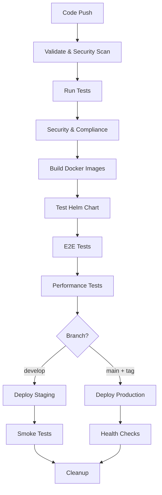

# AgentCare DevOps Guide 🚀

**Complete Infrastructure, Observability, and Deployment Guide for AgentCare v2.0**

## 📋 Table of Contents

- [Overview](#overview)
- [Infrastructure Architecture](#infrastructure-architecture)
- [Observability Stack](#observability-stack)
- [Kubernetes Deployment](#kubernetes-deployment)
- [Helm Charts](#helm-charts)
- [CI/CD Pipeline](#cicd-pipeline)
- [Security & Compliance](#security--compliance)
- [Monitoring & Alerting](#monitoring--alerting)
- [Troubleshooting](#troubleshooting)

---

## 🏗️ Overview

AgentCare v2.0 implements enterprise-grade DevOps practices with:

- **Full Observability**: Metrics, logs, traces, and APM
- **Kubernetes-Native**: Cloud-native deployment with Helm
- **Security-First**: HIPAA compliance and security scanning
- **CI/CD Pipeline**: Automated testing, building, and deployment
- **Infrastructure as Code**: Terraform, Helm, and GitOps

### Architecture Layers



---

## 🏛️ Infrastructure Architecture

### Deployment Environments

| Environment | Purpose | Resources | Scaling |
|-------------|---------|-----------|---------|
| **Development** | Local development | 2 CPU, 4GB RAM | Manual |
| **Staging** | Integration testing | 4 CPU, 8GB RAM | Auto (2-5 pods) |
| **Production** | Live healthcare services | 8 CPU, 16GB RAM | Auto (3-10 pods) |

### Resource Requirements

```yaml
# Minimum Requirements per Environment
development:
  cpu: 2 cores
  memory: 4GB
  storage: 20GB
  
staging:
  cpu: 4 cores
  memory: 8GB
  storage: 100GB
  
production:
  cpu: 8 cores
  memory: 16GB
  storage: 500GB
```

---

## 📊 Observability Stack

### Complete Monitoring Architecture



### 1. **Metrics Collection (Prometheus)**

**Configuration**: `observability/prometheus/prometheus.yml`

```yaml
# Key metrics collected:
- agentcare_http_requests_total
- agentcare_agent_response_duration_seconds
- agentcare_appointments_booked_total
- agentcare_patient_satisfaction_score
- ollama_request_duration_seconds
- redis_connected_clients
- postgres_connections_active
```

**Custom Healthcare Metrics**:
- Appointment booking success rate
- Agent coordination efficiency
- Patient satisfaction scores
- HIPAA compliance violations
- LLM response quality

### 2. **Logging (Loki + Promtail)**

**Structured JSON Logging**:
```json
{
  "timestamp": "2025-01-24T10:00:00Z",
  "level": "info",
  "service": "agentcare-api",
  "agent": "supervisor",
  "user_id": "user_123",
  "action": "appointment_booking",
  "duration_ms": 245,
  "success": true,
  "hipaa_compliant": true
}
```

**Log Levels**:
- `ERROR`: System errors, failures
- `WARN`: Performance issues, degradation
- `INFO`: Business events, user actions
- `DEBUG`: Detailed debugging (dev only)

### 3. **Distributed Tracing (Jaeger)**

**Trace Structure**:
```
📊 User Request → Supervisor Agent → Availability Agent → Database
     ↓              ↓                   ↓                  ↓
   100ms          45ms                120ms              30ms
```

**Key Spans Tracked**:
- HTTP request processing
- Agent coordination
- LLM inference calls
- Database operations
- External API calls

### 4. **Application Performance Monitoring**

**Real-time Dashboards**:
- System health overview
- Agent performance metrics
- Healthcare workflow KPIs
- Security and compliance status

---

## ⚙️ Kubernetes Deployment

### Namespace Structure

```bash
kubectl get namespaces
```

| Namespace | Purpose | Resources |
|-----------|---------|-----------|
| `agentcare` | Main application | API, Ollama, Cache |
| `monitoring` | Observability | Prometheus, Grafana |
| `logging` | Log aggregation | Loki, Promtail |
| `tracing` | Distributed tracing | Jaeger |
| `ingress-nginx` | Traffic routing | Ingress controller |

### Deployment Manifests

**Core Application**: `k8s/namespace.yaml`
- Resource quotas and limits
- Network policies
- Security policies
- RBAC configuration

**Key Features**:
- Pod anti-affinity for HA
- Rolling updates with zero downtime
- Health checks and readiness probes
- Persistent storage for data
- ConfigMaps for configuration
- Secrets for sensitive data

### Storage Classes

```yaml
# High-performance SSD for databases
kind: StorageClass
metadata:
  name: fast-ssd
provisioner: kubernetes.io/aws-ebs
parameters:
  type: gp3
  iops: "3000"
  throughput: "125"

# Standard storage for logs
kind: StorageClass
metadata:
  name: standard
provisioner: kubernetes.io/aws-ebs
parameters:
  type: gp2
```

---

## 📦 Helm Charts

### Chart Structure

```
helm/agentcare/
├── Chart.yaml              # Chart metadata
├── values.yaml             # Default values
├── values-staging.yaml     # Staging overrides
├── values-production.yaml  # Production overrides
├── templates/
│   ├── deployment.yaml     # Application deployment
│   ├── service.yaml        # Kubernetes services
│   ├── ingress.yaml        # Traffic routing
│   ├── configmap.yaml      # Configuration
│   ├── secret.yaml         # Secrets management
│   ├── hpa.yaml           # Horizontal Pod Autoscaler
│   └── servicemonitor.yaml # Prometheus monitoring
└── charts/                 # Sub-charts
```

### Installation Commands

```bash
# Add required Helm repositories
helm repo add bitnami https://charts.bitnami.com/bitnami
helm repo add prometheus-community https://prometheus-community.github.io/helm-charts
helm repo add grafana https://grafana.github.io/helm-charts
helm repo update

# Install dependencies
helm dependency update helm/agentcare

# Deploy to staging
helm upgrade --install agentcare-staging helm/agentcare \
  --namespace agentcare-staging \
  --create-namespace \
  --values helm/agentcare/values-staging.yaml

# Deploy to production
helm upgrade --install agentcare helm/agentcare \
  --namespace agentcare \
  --create-namespace \
  --values helm/agentcare/values-production.yaml
```

### Feature Flags

```yaml
# Enable/disable features via values.yaml
features:
  ollamaLLM: true
  ragSystem: true
  userRegistration: true
  guestBooking: true
  smsNotifications: false
  calendarSync: false
  monitoring: true
  tracing: true
  auditLogging: true
```

---

## 🔄 CI/CD Pipeline

### GitHub Actions Workflow

**File**: `.github/workflows/ci-cd.yml`



### Pipeline Stages

#### 1. **Validation & Security** (1-2 min)
- Code linting and formatting
- Commit message validation
- Dependency vulnerability scan
- Secret scanning with TruffleHog
- SAST with CodeQL

#### 2. **Testing** (3-5 min)
- Unit tests with coverage
- Integration tests with real services
- Contract tests for agent interactions
- HIPAA compliance checks

#### 3. **Building** (2-3 min)
- Multi-architecture Docker images
- Container vulnerability scanning
- SBOM generation
- Image signing

#### 4. **Deployment** (3-5 min)
- Helm chart validation
- Kubernetes manifest testing
- Environment-specific deployment
- Health checks and smoke tests

### Environment Promotion

```mermaid
graph LR
    A[Developer] --> B[Feature Branch]
    B --> C[Pull Request]
    C --> D[Automated Tests]
    D --> E[Code Review]
    E --> F[Merge to Develop]
    F --> G[Deploy to Staging]
    G --> H[Integration Tests]
    H --> I[Merge to Main]
    I --> J[Tag Release]
    J --> K[Deploy to Production]
```



---

## 🔒 Security & Compliance

### HIPAA Compliance

**Data Protection**:
- Encryption at rest and in transit
- Access logging and audit trails
- Role-based access control
- Regular security assessments

**Compliance Checklist**:
- [ ] PHI encryption (AES-256)
- [ ] Access controls (RBAC)
- [ ] Audit logging (7-year retention)
- [ ] Network security (TLS 1.3)
- [ ] Backup and recovery
- [ ] Incident response plan

### Security Scanning

**Static Analysis**:
```bash
# CodeQL for SAST
npm run security:sast

# Dependency vulnerability scan
npm audit --audit-level moderate

# Container security scan
trivy image agentcare/api:latest
```

**Runtime Security**:
- Pod Security Standards
- Network policies
- Admission controllers
- Runtime protection

### Secrets Management

```yaml
# External Secrets Operator
apiVersion: external-secrets.io/v1beta1
kind: SecretStore
metadata:
  name: vault-backend
spec:
  provider:
    vault:
      server: "https://vault.example.com"
      path: "secret"
      version: "v2"
```

---

## 📈 Monitoring & Alerting

### Alert Rules

**File**: `observability/prometheus/rules/agentcare-alerts.yml`

#### Critical Alerts (PagerDuty)
- AgentCare API down
- High appointment booking failure rate
- Patient data access errors
- HIPAA compliance violations

#### Warning Alerts (Slack)
- High response latency
- Agent error rate increase
- Resource usage spikes
- Ollama service degradation

### Dashboard Categories

#### 1. **System Health**
- Service uptime and availability
- Resource utilization (CPU, memory, disk)
- Network performance
- Error rates and latency

#### 2. **Business Metrics**
- Appointment booking rate
- Patient satisfaction scores
- Agent performance KPIs
- Revenue and usage analytics

#### 3. **Security & Compliance**
- Authentication failures
- Unauthorized access attempts
- Data access patterns
- Compliance violations

#### 4. **Healthcare Workflows**
- Appointment lifecycle metrics
- Doctor availability tracking
- Patient interaction patterns
- Clinical workflow efficiency

### SLA Monitoring

| Metric | Target | Alert Threshold |
|--------|--------|----------------|
| Availability | 99.9% | < 99.5% |
| Response Time | < 500ms | > 1000ms |
| Error Rate | < 0.1% | > 0.5% |
| Booking Success | > 95% | < 90% |

---

## 🛠️ Troubleshooting

### Common Issues

#### 1. **Application Won't Start**
```bash
# Check pod status
kubectl get pods -n agentcare

# View logs
kubectl logs -f deployment/agentcare -n agentcare

# Describe pod for events
kubectl describe pod <pod-name> -n agentcare
```

#### 2. **Database Connection Issues**
```bash
# Test PostgreSQL connectivity
kubectl exec -it deployment/agentcare -n agentcare -- \
  npm run db:test

# Check database pod
kubectl get pods -n agentcare -l app=postgresql
```

#### 3. **Ollama LLM Not Responding**
```bash
# Check Ollama service
kubectl get svc -n agentcare ollama

# Test Ollama health
kubectl exec -it deployment/agentcare -n agentcare -- \
  curl http://ollama:11434/api/tags
```

#### 4. **High Memory Usage**
```bash
# Check memory metrics
kubectl top pods -n agentcare

# Adjust resource limits
helm upgrade agentcare helm/agentcare \
  --set agentcare.resources.limits.memory=2Gi
```

### Debug Commands

```bash
# Port forward for local access
kubectl port-forward svc/agentcare 3000:3000 -n agentcare

# Shell into running pod
kubectl exec -it deployment/agentcare -n agentcare -- /bin/sh

# View configuration
kubectl get configmap agentcare-config -n agentcare -o yaml

# Check secrets (without values)
kubectl get secrets -n agentcare

# View recent events
kubectl get events -n agentcare --sort-by='.lastTimestamp'
```

### Performance Tuning

#### Node.js Optimization
```yaml
env:
  - name: NODE_OPTIONS
    value: "--max-old-space-size=1024"
  - name: UV_THREADPOOL_SIZE
    value: "16"
```

#### Database Optimization
```yaml
postgresql:
  primary:
    configuration: |
      max_connections = 200
      shared_buffers = 256MB
      effective_cache_size = 1GB
      maintenance_work_mem = 64MB
```

---

## 📚 Additional Resources

### Documentation Links
- [AgentCare Setup Guide](SETUP_GUIDE.md)
- [Contributing Guidelines](.github/CONTRIBUTING.md)
- [Security Policy](.github/SECURITY.md)
- [API Documentation](docs/api-reference.md)

### External Resources
- [Kubernetes Documentation](https://kubernetes.io/docs/)
- [Helm Documentation](https://helm.sh/docs/)
- [Prometheus Monitoring](https://prometheus.io/docs/)
- [Grafana Dashboards](https://grafana.com/docs/)

### Community & Support
- **GitHub Issues**: Bug reports and feature requests
- **Discussions**: Architecture and design discussions
- **Discord**: Real-time community chat
- **Email**: devops@agentcare.dev

---

## 🚀 Quick Start Commands

```bash
# Clone and setup
git clone https://github.com/vishalm/agentcare.git
cd agentcare

# Local development
npm run dev:setup

# Docker development
npm run dev:docker

# Kubernetes deployment
helm install agentcare helm/agentcare

# Monitor deployment
kubectl get pods -n agentcare -w

# Access application
kubectl port-forward svc/agentcare 3000:3000 -n agentcare
```

---

**Ready to deploy AgentCare to production?** Follow this comprehensive guide to ensure a secure, scalable, and compliant healthcare scheduling system! 🏥✨ 