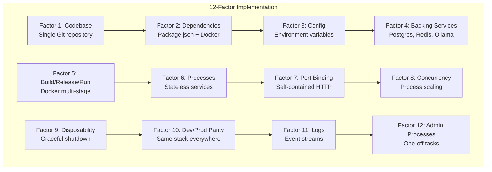

# 12-Factor App Implementation Guide for AgentCare 🏗️

**Cloud-Native Healthcare Scheduling with Complete 12-Factor Compliance**

This guide demonstrates how AgentCare implements all 12 factors of the [12-Factor App methodology](https://12factor.net/), making it truly cloud-native, scalable, and production-ready for modern healthcare environments.

## 📋 Table of Contents

1. [Implementation Overview](#implementation-overview)
2. [The 12 Factors](#the-12-factors)
3. [Quick Start Commands](#quick-start-commands)
4. [Environment Configurations](#environment-configurations)
5. [Deployment Strategies](#deployment-strategies)
6. [Monitoring & Operations](#monitoring--operations)

## 🎯 Implementation Overview

AgentCare has been architected from the ground up to follow 12-Factor principles:



## 🔢 The 12 Factors

### Factor 1: Codebase 📂
*One codebase tracked in revision control, many deploys*

**Implementation:**
- Single Git repository for all environments
- Environment-specific configuration via environment variables
- Version tracking through Git commits and tags

```bash
# Check codebase information
npm run codebase:info

# Deploy same codebase to different environments
npm run deploy:staging   # Same code, staging config
npm run deploy:production # Same code, production config
```

**Files:**
- `backend/src/config/TwelveFactorConfig.ts` - Tracks version info
- Git repository with single source of truth

### Factor 2: Dependencies 📦
*Explicitly declare and isolate dependencies*

**Implementation:**
- `package.json` with exact version specifications
- `package-lock.json` for reproducible builds
- Docker containers for complete isolation
- No system-level dependencies

```bash
# Install exact dependencies
npm ci --only=production

# Build with isolated dependencies
npm run docker:build:12factor

# Verify dependency isolation
npm run deps:audit
```

**Files:**
- `package.json` - Explicit dependency declarations
- `infrastructure/12factor/Dockerfile.12factor` - Container isolation

### Factor 3: Config 🔧
*Store config in the environment*

**Implementation:**
- All configuration via environment variables
- No hardcoded config in code
- Environment-specific .env files
- Validation and defaults

```bash
# Copy environment template
cp infrastructure/12factor/env.12factor.template .env

# Validate environment configuration
npm run config:validate

# Show current configuration
npm run config:show
```

**Files:**
- `backend/src/config/TwelveFactorConfig.ts` - Configuration management
- `infrastructure/12factor/env.12factor.template` - Environment template

### Factor 4: Backing Services 🔌
*Treat backing services as attached resources*

**Implementation:**
- Database, Redis, and Ollama as attached resources
- Service URLs via environment variables
- Health checks for all backing services
- Easy swapping between local and remote services

```bash
# Start all backing services
npm run services:start

# Health check backing services
npm run services:health

# Switch backing service (change DATABASE_URL)
export DATABASE_URL=postgres://new-host:5432/agentcare
```

**Services:**
- PostgreSQL database
- Redis cache
- Ollama LLM service
- External APIs (email, SMS)

### Factor 5: Build, Release, Run 🚀
*Strictly separate build and run stages*

**Implementation:**
- Multi-stage Docker builds
- Immutable releases with version tags
- Separate build, release, and runtime environments
- CI/CD pipeline with distinct stages

```bash
# Build stage
npm run build

# Release stage (create immutable artifact)
npm run release:create

# Run stage (execute release)
npm run run:release v2.0.0
```

**Pipeline:**
1. **Build**: `npm run build` → Compiled artifacts
2. **Release**: Docker image with version tag
3. **Run**: Deploy release to environment

### Factor 6: Processes 📋
*Execute the app as one or more stateless processes*

**Implementation:**
- Stateless application processes
- Shared-nothing architecture
- State stored in backing services
- Process manager for coordination

```bash
# Start stateless processes
npm run processes:start

# Scale web processes
npm run processes:scale web 5

# View process status
npm run processes:status
```

**Process Types:**
- **Web**: HTTP request handlers
- **Worker**: Background job processors
- **Scheduler**: Cron job handlers

### Factor 7: Port Binding 🌐
*Export services via port binding*

**Implementation:**
- Self-contained HTTP server
- No external web server required
- Port configuration via environment
- Service discovery through port binding

```bash
# Start on default port
npm start

# Start on custom port
PORT=8080 npm start

# Multiple instances with different ports
PORT=3001 npm start &
PORT=3002 npm start &
```

**Configuration:**
- `PORT=3000` (default)
- `HOST=0.0.0.0` (bind to all interfaces)

### Factor 8: Concurrency 🔄
*Scale out via the process model*

**Implementation:**
- Horizontal scaling through process replication
- Process-type specific scaling
- Load balancing across instances
- PM2 cluster mode

```bash
# Scale horizontally
npm run scale:web 5
npm run scale:worker 3

# Auto-scaling based on metrics
npm run scale:auto

# Cluster mode with PM2
npm run pm2:cluster
```

**Scaling Strategies:**
- Web processes: 2-10 instances (CPU-bound)
- Worker processes: 2-5 instances (I/O-bound)
- Scheduler: 1 instance (coordination)

### Factor 9: Disposability ⚡
*Maximize robustness with fast startup and graceful shutdown*

**Implementation:**
- Fast startup (<10 seconds)
- Graceful shutdown on SIGTERM
- Proper cleanup of resources
- Health checks for readiness

```bash
# Test startup time
npm run startup:benchmark

# Test graceful shutdown
npm run shutdown:test

# Chaos testing
npm run chaos:kill-random
```

**Features:**
- Process restart on failure
- Connection draining
- Resource cleanup
- Health check integration

### Factor 10: Dev/prod parity 🔄
*Keep development, staging, and production as similar as possible*

**Implementation:**
- Same Docker images across environments
- Same backing services (Postgres, Redis, Ollama)
- Environment variables for differences
- Minimal time gap between environments

```bash
# Run exact production stack locally
npm run dev:production-mode

# Deploy same image to staging
npm run deploy:staging

# Promote staging to production
npm run promote:staging-to-prod
```

**Parity Measures:**
- **Time gap**: < 1 day deployment cycle
- **Personnel gap**: Same team handles dev and ops
- **Tools gap**: Same stack everywhere

### Factor 11: Logs 📊
*Treat logs as event streams*

**Implementation:**
- Structured JSON logging to stdout
- No local log files
- Log aggregation via external tools
- Healthcare-specific audit logging

```bash
# View live log stream
npm run logs:stream

# Filter by log level
npm run logs:errors

# HIPAA audit logs
npm run logs:audit
```

**Log Structure:**
```json
{
  "timestamp": "2024-01-15T10:30:00Z",
  "level": "info",
  "message": "Appointment created",
  "service": "agentcare",
  "patientId": "p123",
  "doctorId": "d456",
  "hipaaCompliant": true,
  "auditEvent": true
}
```

### Factor 12: Admin processes 🛠️
*Run admin/management tasks as one-off processes*

**Implementation:**
- Database migrations as one-off processes
- Data seeding via admin commands
- Backup/restore operations
- Same codebase and environment

```bash
# Database migration
npm run admin:migrate

# Seed initial data
npm run admin:seed

# Create backup
npm run admin:backup

# One-off data processing
npm run admin:process-data
```

**Admin Commands:**
- `migrate`: Database schema updates
- `seed`: Initial data population
- `backup`: Data backup creation
- `restore`: Data restoration

## 🚀 Quick Start Commands

### Development Environment
```bash
# 1. Setup 12-Factor environment
cp infrastructure/12factor/env.12factor.template .env
npm install

# 2. Start with 12-Factor principles
npm run dev:12factor

# 3. Verify all factors
npm run verify:12factor
```

### Production Deployment
```bash
# 1. Build 12-Factor compliant image
npm run build:12factor

# 2. Deploy with Docker Compose
npm run deploy:12factor

# 3. Verify deployment
npm run health:12factor
```

### Scaling Operations
```bash
# Horizontal scaling
npm run scale:web 5
npm run scale:worker 3

# Auto-scaling
npm run autoscale:enable

# Process management
npm run pm2:cluster
```

## 🌍 Environment Configurations

### Development
```bash
NODE_ENV=development
LOG_LEVEL=debug
ENABLE_DEBUG=true
WEB_CONCURRENCY=1
```

### Staging
```bash
NODE_ENV=staging
LOG_LEVEL=info
ENABLE_DEBUG=false
WEB_CONCURRENCY=2
```

### Production
```bash
NODE_ENV=production
LOG_LEVEL=warn
ENABLE_DEBUG=false
WEB_CONCURRENCY=5
```

## 🚀 Deployment Strategies

### Local Development
```bash
# Docker Compose with 12-Factor principles
docker-compose -f infrastructure/12factor/docker-compose.12factor.yml up
```

### Kubernetes
```bash
# Deploy to Kubernetes with 12-Factor compliance
kubectl apply -f infrastructure/kubernetes/12factor/
```

### Cloud Platforms
```bash
# Heroku (12-Factor native)
git push heroku main

# AWS ECS
npm run deploy:aws-ecs

# Google Cloud Run
npm run deploy:gcloud-run
```

## 📊 Monitoring & Operations

### Health Checks
```bash
# Overall system health
curl http://localhost:3000/health

# 12-Factor compliance check
npm run health:12factor

# Backing services health
npm run health:services
```

### Metrics & Logging
```bash
# View structured logs
npm run logs:json

# Metrics dashboard
npm run metrics:dashboard

# Performance monitoring
npm run perf:monitor
```

### Scaling & Performance
```bash
# Load testing
npm run load-test

# Performance profiling
npm run profile

# Auto-scaling metrics
npm run autoscale:metrics
```

## 🔧 Verification Commands

### Validate 12-Factor Compliance
```bash
# Complete 12-Factor validation
npm run validate:12factor

# Individual factor checks
npm run validate:codebase      # Factor 1
npm run validate:dependencies  # Factor 2
npm run validate:config       # Factor 3
npm run validate:services     # Factor 4
npm run validate:build        # Factor 5
npm run validate:processes    # Factor 6
npm run validate:port-binding # Factor 7
npm run validate:concurrency  # Factor 8
npm run validate:disposability # Factor 9
npm run validate:dev-prod-parity # Factor 10
npm run validate:logs         # Factor 11
npm run validate:admin        # Factor 12
```

## 📈 Benefits Achieved

### Scalability
- **Horizontal scaling**: Process-based concurrency
- **Stateless design**: Easy load distribution
- **Resource isolation**: Container-based deployment

### Reliability
- **Graceful degradation**: Circuit breakers and fallbacks
- **Fast recovery**: Quick startup and health checks
- **Fault isolation**: Process-level fault boundaries

### Maintainability
- **Clear separation**: Build, release, run stages
- **Configuration management**: Environment-based config
- **Observability**: Structured logging and monitoring

### Cloud-Native
- **Platform agnostic**: Runs anywhere containers run
- **Auto-scaling**: Metrics-based horizontal scaling
- **Service discovery**: Port-based service binding

## 🎯 Next Steps

1. **Review**: Study each factor implementation
2. **Customize**: Adapt environment variables for your setup
3. **Deploy**: Use Docker Compose for local testing
4. **Scale**: Implement in Kubernetes for production
5. **Monitor**: Set up log aggregation and metrics
6. **Iterate**: Continuously improve 12-Factor compliance

---

## 📚 References

- [The Twelve-Factor App](https://12factor.net/)
- [Docker Best Practices](https://docs.docker.com/develop/dev-best-practices/)
- [Kubernetes Patterns](https://k8spatterns.io/)
- [HIPAA Compliance Guide](https://www.hhs.gov/hipaa/index.html)

**🏥 Ready to deploy cloud-native healthcare systems?** 

This 12-Factor implementation ensures AgentCare can scale from a single developer machine to enterprise-grade healthcare infrastructure with millions of appointments! 🚀✨ 