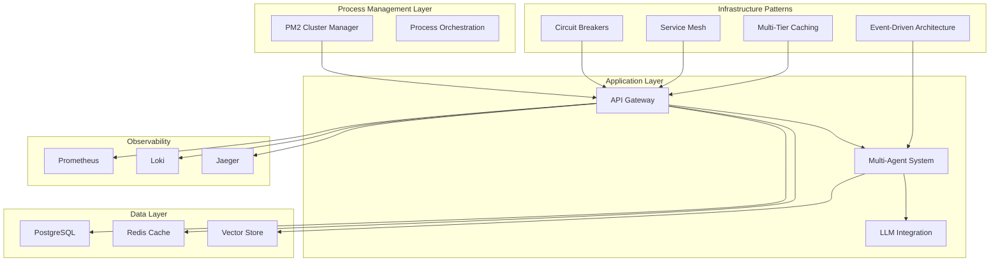

# AgentCare Architecture Guide 🏗️

**Enterprise-Grade Multi-Agent Healthcare Scheduling System**

This document provides a comprehensive overview of AgentCare's architectural patterns, design decisions, and implementation strategies for building a scalable, resilient, and high-performance healthcare platform.

## 📋 Table of Contents

1. [Architectural Overview](#architectural-overview)
2. [Process Management with PM2](#process-management-with-pm2)
3. [Resilience Patterns](#resilience-patterns)
4. [Event-Driven Architecture](#event-driven-architecture)
5. [Service Mesh & Microservices](#service-mesh--microservices)
6. [Multi-Tier Caching](#multi-tier-caching)
7. [Observability & Monitoring](#observability--monitoring)
8. [Security Architecture](#security-architecture)
9. [Performance & Scalability](#performance--scalability)
10. [Deployment Strategies](#deployment-strategies)

## 🏛️ Architectural Overview

AgentCare implements a modern, cloud-native architecture using multiple design patterns:



### Core Architectural Principles

1. **Resilience-First Design**: Circuit breakers, bulkheads, and graceful degradation
2. **Event-Driven Communication**: Asynchronous messaging and CQRS patterns
3. **Horizontal Scalability**: Cluster mode, load balancing, and auto-scaling
4. **Observability by Design**: Comprehensive metrics, logs, and traces
5. **Security & Compliance**: HIPAA-compliant data handling and audit trails

## 🔄 Process Management with PM2

### Cluster Architecture

AgentCare uses PM2 for advanced process management and horizontal scaling:

```javascript
// ecosystem.config.js
{
  name: 'agentcare-api',
  script: './backend/dist/index.js',
  instances: 'max',           // Use all CPU cores
  exec_mode: 'cluster',       // Cluster mode for load balancing
  max_memory_restart: '1G',   // Restart on memory limit
  autorestart: true,          // Auto-restart on crash
}
```

### Service Orchestration

Multiple specialized services run in parallel:

- **API Server**: Main application cluster (max instances)
- **Agent Coordinator**: Agent orchestration service (2 instances)
- **LLM Processor**: AI processing service (1 instance, GPU-intensive)
- **Job Processor**: Background jobs (2 instances)
- **Metrics Collector**: Observability data collection (1 instance)

### Process Commands

```bash
# Start all services in cluster mode
npm run pm2:start

# Monitor all processes
npm run pm2:monit

# Zero-downtime deployment
npm run pm2:reload

# Production deployment
npm run pm2:deploy:production
```

## 🛡️ Resilience Patterns

### Circuit Breaker Pattern

Prevents cascading failures by temporarily blocking calls to failing services:

```typescript
// Circuit breaker for external services
const ollamaBreaker = registry.createBreaker('ollama-llm', {
  failureThreshold: 3,      // Open after 3 failures
  successThreshold: 2,      // Close after 2 successes
  timeout: 30000,          // 30-second timeout
  monitoringPeriod: 60000  // 1-minute monitoring window
});

// Usage with fallback
const result = await ollamaBreaker.executeWithFallback(
  () => callOllamaService(request),
  () => generateFallbackResponse()
);
```

### Bulkhead Pattern

Isolates critical resources to prevent resource pool exhaustion:

- **Separate thread pools** for different agent types
- **Resource quotas** for LLM processing
- **Connection pooling** with limits for database access

### Retry Mechanisms

Exponential backoff with jitter for transient failures:

```typescript
// Retry configuration
const retryPolicy: RetryPolicy = {
  maxRetries: 3,
  baseDelayMs: 1000,
  maxDelayMs: 10000,
  backoffMultiplier: 2,
  retryableErrors: ['NetworkError', 'TimeoutError']
};
```

## 📡 Event-Driven Architecture

### CQRS Implementation

Separates read and write operations for better scalability:

```typescript
// Command handling
await commandBus.execute({
  type: 'ScheduleAppointment',
  data: { patientId, doctorId, time }
});

// Query handling
const appointments = await queryBus.execute({
  type: 'GetPatientAppointments',
  parameters: { patientId, startDate, endDate }
});
```

### Event Sourcing

All state changes are captured as immutable events:

```typescript
// Event storage
const event: AppointmentScheduledEvent = {
  id: generateId(),
  aggregateId: appointmentId,
  eventType: 'AppointmentScheduled',
  version: 1,
  timestamp: new Date(),
  data: { patientId, doctorId, scheduledTime }
};

await eventStore.save(event);
```

### Saga Pattern

Manages distributed transactions across multiple services:

```typescript
// Appointment scheduling saga
const saga = new AppointmentSchedulingSaga(
  patientId, doctorId, appointmentTime, duration
);

await saga.execute(); // Handles compensation on failure
```

## 🕸️ Service Mesh & Microservices

### Service Discovery

Automatic service registration and discovery:

```typescript
// Service registration
const service: ServiceInstance = {
  id: 'api-001',
  name: 'agentcare-api',
  host: 'localhost',
  port: 3000,
  healthCheckPath: '/health',
  metadata: { version: '2.0.0', weight: 1 }
};

await serviceRegistry.register(service);
```

### Load Balancing Strategies

Multiple load balancing algorithms:

- **Round Robin**: Equal distribution across instances
- **Weighted**: Based on instance capacity/weight
- **Least Connections**: Routes to least busy instance

### Inter-Service Communication

```typescript
// Service mesh gateway
const result = await gateway.callService(
  'user-management',
  async (serviceUrl) => {
    return fetch(`${serviceUrl}/api/users/${userId}`);
  },
  {
    timeout: 5000,
    retries: 3,
    fallback: () => getCachedUser(userId)
  }
);
```

## 🗄️ Multi-Tier Caching

### Cache Hierarchy

Three-tier caching architecture:

1. **L1 Cache**: In-memory cache (300s TTL)
2. **L2 Cache**: Redis distributed cache (3600s TTL)
3. **L3 Cache**: Database with query optimization

### Cache Strategies

```typescript
// Cache decorator
@Cached(
  (patientId) => HealthcareCacheKeys.patient(patientId),
  300, // 5-minute TTL
  'BOTH' // Both L1 and L2
)
async getPatient(patientId: string): Promise<Patient> {
  return await this.database.getPatient(patientId);
}
```

### Cache Warming

Proactive cache population for frequently accessed data:

```typescript
// Warm healthcare data
cacheWarming.scheduleWarming(
  'departments:all',
  async () => await this.loadDepartments(),
  3600000 // Every hour
);
```

### Cache Analytics

Real-time cache performance monitoring:

- **Hit rates** by cache tier
- **Hourly performance** patterns
- **Efficiency recommendations**
- **Cache size optimization**

## 📊 Observability & Monitoring

### Three Pillars of Observability

1. **Metrics** (Prometheus)
   - Application metrics (response times, error rates)
   - Business metrics (appointment bookings, cancellations)
   - Infrastructure metrics (CPU, memory, disk)

2. **Logs** (Loki)
   - Structured JSON logging
   - Correlation IDs for request tracing
   - HIPAA-compliant audit logs

3. **Traces** (Jaeger)
   - Distributed request tracing
   - Agent coordination flows
   - Performance bottleneck identification

### Health Check Aggregation

Comprehensive health monitoring:

```typescript
const health = await healthAggregator.getOverallHealth();
// Returns: 'healthy' | 'degraded' | 'unhealthy'
```

### Alerting Strategy

Multi-level alerting system:

- **Critical**: System outages, security breaches
- **Warning**: Performance degradation, resource limits
- **Info**: Deployment notifications, maintenance windows

## 🔒 Security Architecture

### Multi-Layer Security

1. **Authentication & Authorization**
   - JWT tokens with secure session management
   - Role-based access control (RBAC)
   - Multi-factor authentication support

2. **Data Protection**
   - AES-256 encryption at rest
   - TLS 1.3 encryption in transit
   - Field-level encryption for PII

3. **HIPAA Compliance**
   - Audit logging with 7-year retention
   - Data anonymization capabilities
   - Access controls and user consent tracking

4. **Infrastructure Security**
   - Container security scanning
   - Dependency vulnerability assessment
   - Network policies and segmentation

## ⚡ Performance & Scalability

### Horizontal Scaling

```bash
# Auto-scaling configuration
kubectl autoscale deployment agentcare \
  --cpu-percent=70 \
  --min=2 \
  --max=10 \
  -n agentcare
```

### Performance Optimization

1. **Connection Pooling**
   - Database connection pools
   - Redis connection management
   - HTTP keep-alive connections

2. **Query Optimization**
   - Database indexing strategies
   - Query result caching
   - Pagination for large datasets

3. **Resource Management**
   - Memory leak detection
   - CPU usage optimization
   - Garbage collection tuning

### Performance Testing

```bash
# Load testing
npm run perf:load-test

# Stress testing
npm run perf:stress-test

# Performance profiling
npm run perf:profile
```

## 🚀 Deployment Strategies

### Blue-Green Deployment

Zero-downtime deployments using blue-green strategy:

```bash
# Deploy to staging environment
npm run deploy:staging

# Production deployment with validation
npm run deploy:production
```

### Canary Deployment

Gradual rollout to minimize risk:

1. Deploy to 5% of traffic
2. Monitor metrics and error rates
3. Gradually increase traffic
4. Full rollout or rollback

### Infrastructure as Code

- **Helm Charts**: Kubernetes deployment manifests
- **Docker**: Containerized application deployment
- **Terraform**: (Future) Infrastructure provisioning

## 🎯 Architecture Commands

### Process Management
```bash
npm run pm2:start          # Start all services
npm run pm2:cluster        # Production cluster mode
npm run pm2:monit          # Process monitoring
```

### Pattern Testing
```bash
npm run patterns:circuit-breaker  # Test circuit breakers
npm run patterns:event-driven     # Test event architecture
npm run patterns:service-mesh     # Test service mesh
npm run patterns:caching         # Test caching layer
```

### Architecture Analysis
```bash
npm run arch:health        # Overall system health
npm run arch:metrics       # Architecture metrics
npm run arch:patterns      # Pattern implementation status
```

### Performance & Resilience
```bash
npm run perf:benchmark     # Performance benchmarks
npm run resilience:test    # Chaos engineering tests
npm run scaling:auto       # Enable auto-scaling
```

### Cache Management
```bash
npm run cache:warm         # Warm cache with data
npm run cache:stats        # Cache performance stats
npm run cache:analytics    # Cache efficiency analysis
```

### Service Mesh Operations
```bash
npm run service-mesh:registry  # Service registry status
npm run service-mesh:health    # Service health overview
npm run circuit-breaker:status # Circuit breaker metrics
```

## 📈 Monitoring & Alerts

### Key Performance Indicators

- **Response Time**: < 500ms for 95th percentile
- **Availability**: 99.9% uptime SLA
- **Error Rate**: < 0.1% for critical operations
- **Cache Hit Rate**: > 80% for frequently accessed data

### Business Metrics

- **Appointment Booking Success Rate**: > 95%
- **Patient Satisfaction Score**: > 4.5/5.0
- **Doctor Utilization Rate**: 80-90%
- **System Adoption Rate**: Month-over-month growth

## 🔮 Future Enhancements

### Planned Architecture Improvements

1. **Microservices Decomposition**
   - Break monolith into specialized services
   - Service mesh with Istio/Linkerd
   - Event sourcing with Kafka

2. **Advanced AI/ML**
   - Custom model training pipelines
   - Federated learning for privacy
   - Real-time recommendation engine

3. **Global Distribution**
   - Multi-region deployment
   - Edge computing for low latency
   - Data sovereignty compliance

4. **Advanced Observability**
   - AI-powered anomaly detection
   - Predictive performance analysis
   - Automated remediation

## 📚 References & Further Reading

- [Enterprise Integration Patterns](https://www.enterpriseintegrationpatterns.com/)
- [Microservices Patterns](https://microservices.io/)
- [PM2 Process Manager](https://pm2.keymetrics.io/)
- [Circuit Breaker Pattern](https://martinfowler.com/bliki/CircuitBreaker.html)
- [Event Sourcing](https://martinfowler.com/eaaDev/EventSourcing.html)
- [CQRS Pattern](https://martinfowler.com/bliki/CQRS.html)

---

## 🤝 Contributing to Architecture

For architecture contributions, see [CONTRIBUTING.md](.github/CONTRIBUTING.md) and follow our architectural decision record (ADR) process.

**Ready to build enterprise-grade healthcare systems?** 🏥✨

This architecture guide provides the foundation for building scalable, resilient, and high-performance healthcare applications with modern architectural patterns and best practices. 