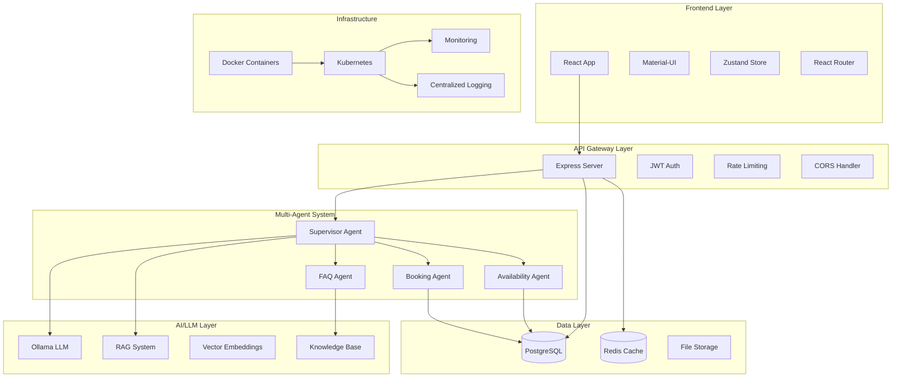
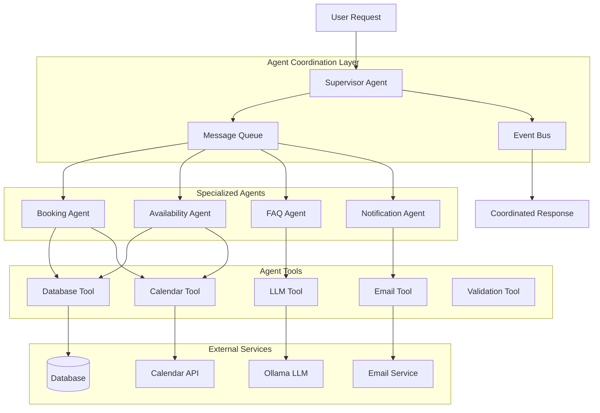
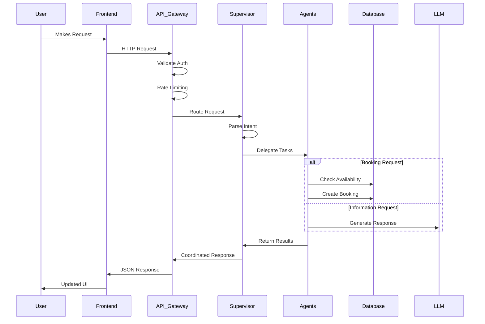
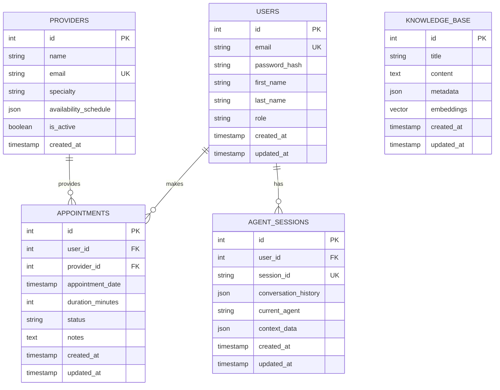
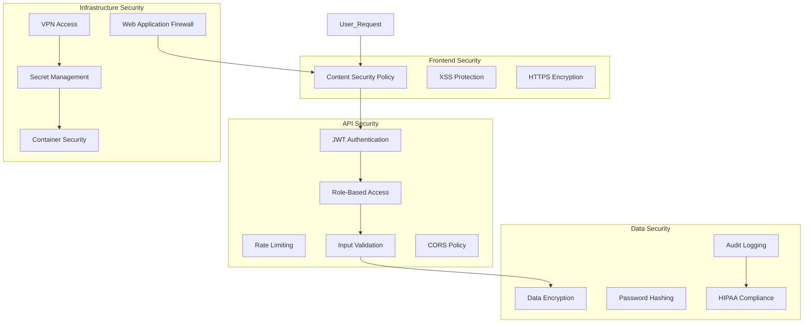
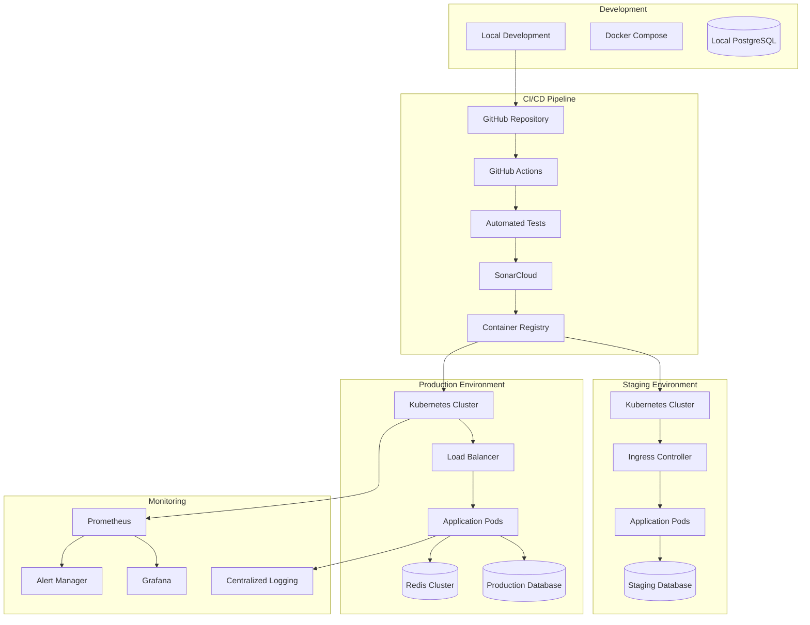
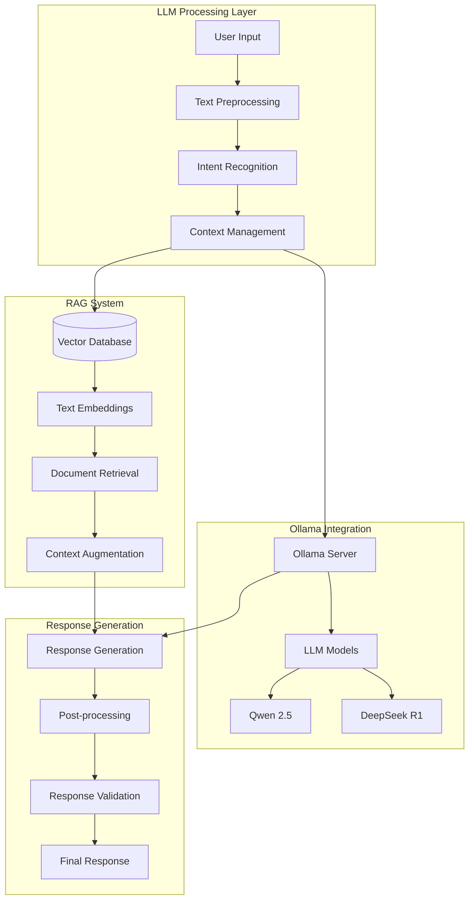
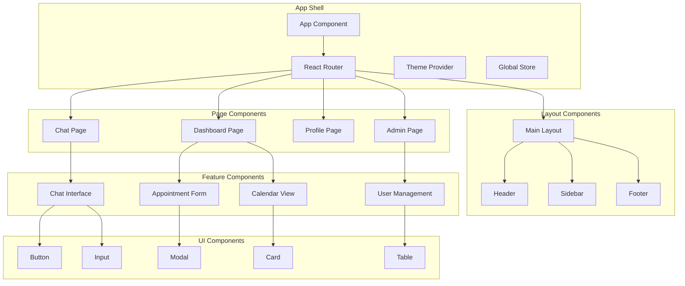

# AgentCare System Architecture Diagrams

## 🏗️ High-Level System Architecture

## 🤖 Multi-Agent Architecture

## 🔄 Request Flow Architecture

## 📊 Data Architecture

## 🛡️ Security Architecture

## 🚀 Deployment Architecture

## 🔄 AI/LLM Integration Architecture

## 📱 Frontend Component Architecture

These diagrams provide a comprehensive visual representation of the AgentCare system architecture, covering all major components and their interactions. They can be used for:

- **System Understanding**: Quick overview of how components interact
- **Documentation**: Technical documentation for developers
- **Planning**: Architecture decisions and future enhancements
- **Troubleshooting**: Understanding data flow for debugging
- **Onboarding**: Helping new team members understand the system 