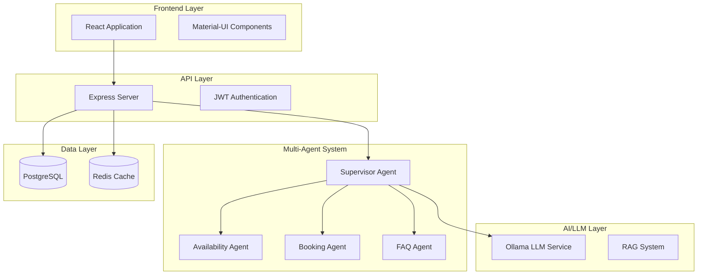

# 📚 AgentCare Documentation

Welcome to the comprehensive documentation for AgentCare - the AI-powered healthcare scheduling platform. This documentation provides everything you need to understand, deploy, and develop with AgentCare.

## 🚀 Quick Navigation

### 🏃‍♂️ Getting Started
- **[🚀 Quick Start Guide](setup/QUICK_START.md)** - Get up and running in minutes
- **[🐳 Docker Setup](setup/DOCKER_SETUP.md)** - Complete containerized development environment
- **[⚙️ Environment Configuration](setup/ENVIRONMENT_SETUP.md)** - Configuration and environment variables

### 🏗️ Architecture & Design
- **[📊 System Architecture](architecture/diagrams/SYSTEM_ARCHITECTURE.md)** - Visual system diagrams
- **[🏛️ Architecture Guide](architecture/ARCHITECTURE_GUIDE.md)** - Detailed system design
- **[🏢 Multi-Tenancy](architecture/MULTI_TENANCY_GUIDE.md)** - Tenant isolation and management
- **[🔄 12-Factor App](architecture/TWELVE_FACTOR_GUIDE.md)** - 12-Factor methodology compliance

### 📁 Project Organization
- **[📂 Project Structure](PROJECT_STRUCTURE.md)** - Complete codebase organization
- **[📋 Documentation Organization](DOCUMENTATION_ORGANIZATION.md)** - How docs are structured

### 🔧 API & Development
- **[📖 API Reference](api-reference.md)** - Complete REST API documentation
- **[🧪 Testing Guide](testing.md)** - Comprehensive testing strategies
- **[🎯 Features Guide](features.md)** - Platform features overview

### 🚀 Enterprise Features
- **[🏥 Enterprise Guide](enterprise.md)** - Enterprise features and capabilities
- **[🔒 Security & Compliance](operations/SECURITY.md)** - Security best practices

## 🎯 Quick Reference

### 🔗 Essential Links
- **[GitHub Repository](https://github.com/vishalm/agentcare)** - Source code and issues
- **[Live Demo](https://vishalm.github.io/agentcare/)** - Interactive frontend demo
- **[CI/CD Pipeline](https://github.com/vishalm/agentcare/actions)** - Build and deployment status

### ⚡ Quick Commands
```bash
# Quick start
npm run setup                 # Complete setup
npm run dev                   # Start development
npm run build                 # Build for production
npm run test                  # Run all tests

# Docker commands
docker-compose up             # Start all services
npm run docker:build         # Build containers

# Database operations
npm run db:setup             # Initialize database
npm run db:seed              # Add demo data
```

### 🏥 Demo Credentials
All demo accounts use password: **`AgentCare2024!`**
- **Admin**: `admin@agentcare.dev`
- **Doctor**: `doctor@agentcare.dev` 
- **Patient**: `patient@agentcare.dev`

### 🌐 Service Endpoints (Development)
- **Frontend**: http://localhost:3001
- **Backend API**: http://localhost:3000
- **API Docs**: http://localhost:3000/api/docs
- **Health Check**: http://localhost:3000/health

## 📊 System Overview



## 🤝 Contributing to Documentation

### How to Contribute
1. **Find areas for improvement** in existing docs
2. **Add missing documentation** for new features
3. **Update outdated information** as system evolves
4. **Improve clarity and examples** for better understanding

### Documentation Standards
- **Markdown format** for all documentation
- **Mermaid diagrams** for visual representations
- **Code examples** with proper syntax highlighting
- **Cross-references** to related documentation

## 📞 Support & Resources

### Getting Help
- **[GitHub Issues](https://github.com/vishalm/agentcare/issues)** - Bug reports and feature requests
- **[Documentation Issues](https://github.com/vishalm/agentcare/issues/new?labels=documentation)** - Documentation improvements

### Additional Resources
- **[Contributing Guide](../CONTRIBUTING.md)** - How to contribute to the project
- **[License](../LICENSE)** - MIT license details

---

<div align="center">

**📚 Comprehensive documentation for a comprehensive platform**

[🏠 Home](../README.md) • [🚀 Quick Start](setup/QUICK_START.md) • [🏗️ Architecture](architecture/ARCHITECTURE_GUIDE.md) • [🔧 API](api-reference.md)

</div> 