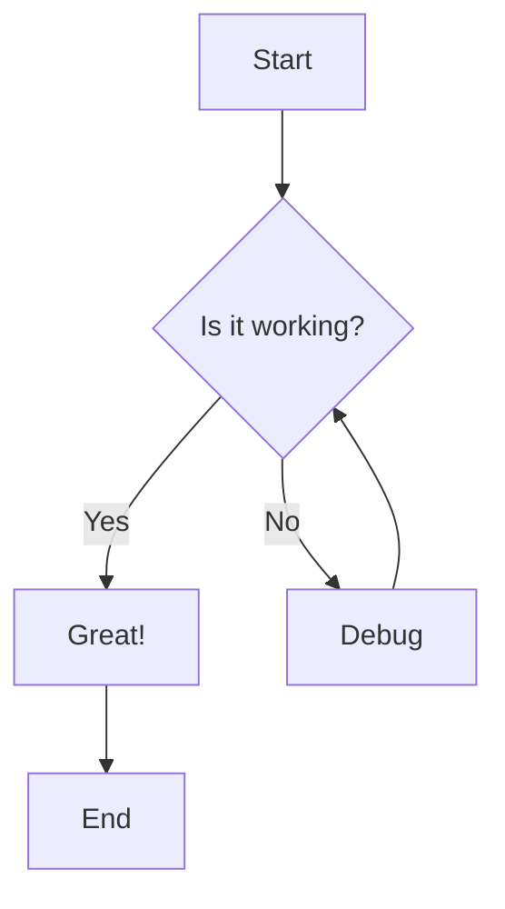
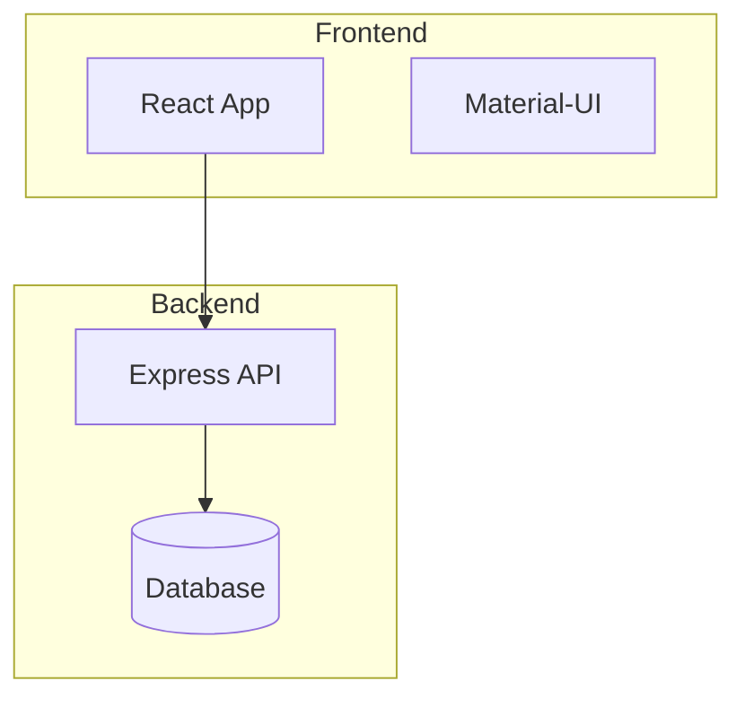
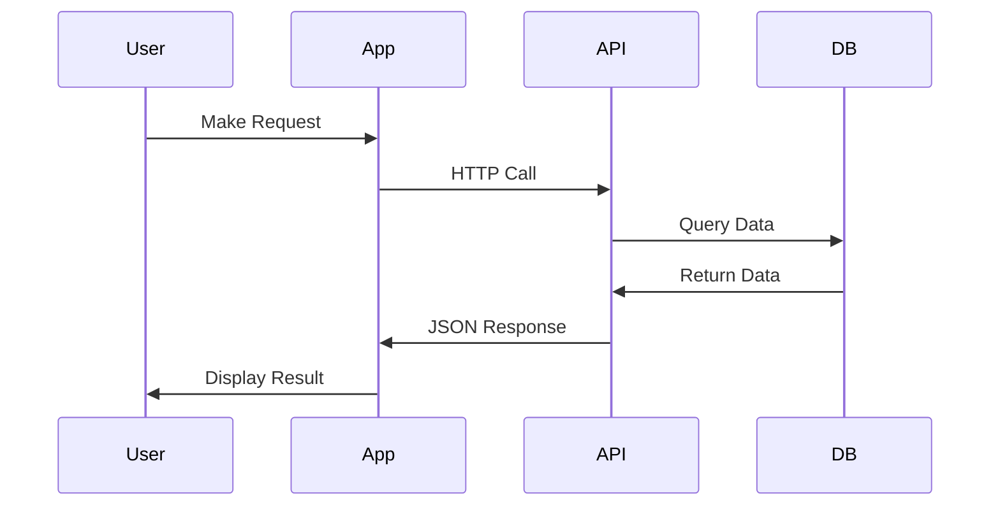

# Mermaid Diagram Test

This page tests whether Mermaid diagrams are rendering correctly on GitHub Pages.

## Simple Flowchart Test

## System Architecture Test

## Sequence Diagram Test

If you can see properly rendered diagrams above (not just code blocks), then Mermaid is working correctly!

---

[← Back to Documentation](index.md) | [View on GitHub](https://github.com/vishalm/agentcare) 