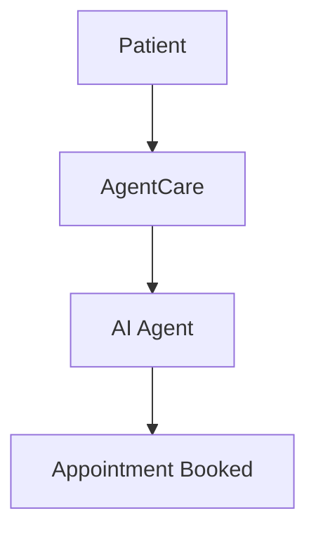

# GitHub Pages Publishing for AgentCare Documentation

This folder contains the GitHub Pages configuration for publishing AgentCare documentation.

## 🚀 Quick Setup

### 1. Enable GitHub Pages
1. Go to your repository Settings
2. Scroll down to "Pages" section
3. Select "Deploy from a branch"
4. Choose `main` branch and `/github-pages` folder
5. Click Save

### 2. Sync Documentation
To keep GitHub Pages updated with the main docs:

```bash
# Copy documentation to GitHub Pages folder
cp -r docs/* github-pages/
cp README.md github-pages/main-readme.md

# Update Jekyll front matter as needed
# Commit and push changes
git add github-pages/
git commit -m "docs: update GitHub Pages"
git push origin main
```

### 3. Custom Domain (Optional)
1. Add a `CNAME` file with your domain
2. Configure DNS settings
3. Enable HTTPS in repository settings

## 📁 Structure

```
github-pages/
├── _config.yml          # Jekyll configuration
├── index.md             # Main documentation page
├── setup/               # Setup guides
├── operations/          # Operations documentation
├── architecture/        # Architecture guides
├── testing/             # Testing documentation
├── guides/              # Reference guides
└── README.md           # This file
```

## 🔧 Jekyll Configuration

The `_config.yml` file is configured for:
- **Theme**: Minima (GitHub Pages default)
- **Collections**: Organized by documentation type
- **Plugins**: SEO, sitemap, feed generation, and **Mermaid diagrams**
- **Navigation**: Automatic menu generation
- **Mermaid Support**: Beautiful healthcare-themed diagrams

## 📝 Content Updates

When updating documentation:

1. **Main Docs**: Edit files in `/docs/` folder
2. **Sync to Pages**: Copy changes to `/github-pages/`
3. **Jekyll Front Matter**: Add YAML headers if needed
4. **Test Locally**: Use `bundle exec jekyll serve`
5. **Mermaid Diagrams**: Use \`\`\`mermaid code blocks for beautiful diagrams

### 📊 Creating Mermaid Diagrams

Add interactive diagrams to your documentation:

````markdown

````

See [Mermaid Guide](mermaid-guide.md) for comprehensive examples.

## 🎨 Customization

### Custom CSS
Add custom styles in `assets/css/style.scss`:

```scss
@import "minima";

.site-header {
  background-color: #2c5aa0;
}
```

### Custom Layouts
Create layouts in `_layouts/` folder:

```yaml
---
layout: default
---

<div class="healthcare-layout">
  {{ content }}
</div>
```

## 🔗 URL Structure

GitHub Pages will serve documentation at:
- Main: `https://yourusername.github.io/agentcare/`
- Setup: `https://yourusername.github.io/agentcare/setup/`
- Operations: `https://yourusername.github.io/agentcare/operations/`

## 📊 Analytics

Add Google Analytics in `_config.yml`:

```yaml
google_analytics: GA_TRACKING_ID
```

## 🛠️ Local Development

Test GitHub Pages locally:

```bash
# Install dependencies
bundle install

# Serve locally
bundle exec jekyll serve

# Open browser
open http://localhost:4000
```

## 🔄 Automation

Consider setting up GitHub Actions for automatic syncing:

```yaml
# .github/workflows/docs.yml
name: Sync Documentation
on:
  push:
    paths: ['docs/**']
jobs:
  sync:
    runs-on: ubuntu-latest
    steps:
      - uses: actions/checkout@v2
      - name: Sync docs to GitHub Pages
        run: |
          cp -r docs/* github-pages/
          git config --local user.email "action@github.com"
          git config --local user.name "GitHub Action"
          git add github-pages/
          git commit -m "docs: auto-sync to GitHub Pages" || exit 0
          git push
```

## 📞 Support

For GitHub Pages issues:
- Check [GitHub Pages Documentation](https://docs.github.com/en/pages)
- Review [Jekyll Documentation](https://jekyllrb.com/docs/)
- Test locally before pushing

---

**🏥 AgentCare Documentation Publishing**  
*Professional documentation hosting for healthcare technology* 