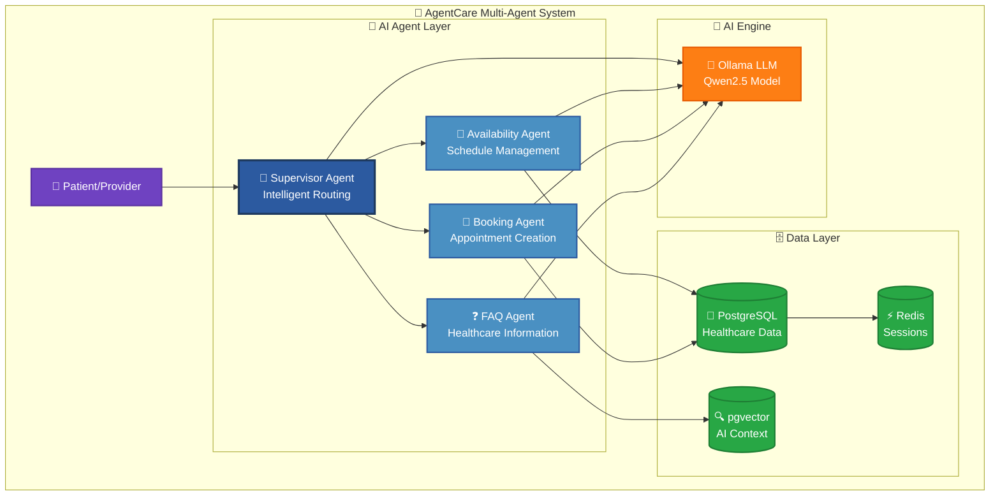

# 🏥 AgentCare Documentation

**Enterprise-grade multi-agent healthcare scheduling platform with AI coordination and HIPAA compliance**

Welcome to the comprehensive documentation for AgentCare - a cutting-edge healthcare scheduling system featuring coordinated AI agents, multi-tenant architecture, and enterprise-grade security.

## 🚀 Quick Start

```bash
# One-command setup
./docker-quick-start.sh

# System health check
./agentcare-inspector.sh
```

**Access Points:**
- Frontend: [http://localhost:3001](http://localhost:3001)
- Backend API: [http://localhost:3000](http://localhost:3000)
- Ollama LLM: [http://localhost:11434](http://localhost:11434)

## 📚 Documentation Sections

### [🎯 Setup & Configuration](setup/)
Get AgentCare running in your environment with comprehensive installation guides.
- Complete setup instructions
- Docker deployment guides
- Development environment configuration

### [🛠️ Operations & Deployment](operations/)
Monitor, maintain, and troubleshoot your AgentCare deployment.
- System health monitoring
- Container management
- CI/CD deployment strategies

### [🏗️ Architecture & Design](architecture/)
Understand the system design and multi-tenant architecture.
- System architecture overview
- Multi-tenancy implementation
- Healthcare data isolation strategies

### [🧪 Testing & Quality](testing/)
Comprehensive testing for healthcare systems with HIPAA compliance.
- Testing framework overview
- Healthcare-specific test strategies
- Security and compliance validation

### [📖 Reference & Guides](guides/)
User management, healthcare workflows, and system reference.
- Healthcare user roles (24+ types)
- Project status and roadmap
- System reference information

### [📚 Knowledge Base Reference](reference/)
Complete collection of all README content for comprehensive reference.
- Main README reference with quick start guides
- Documentation README with navigation structure
- Complete knowledge base for all project information

## 🏥 Key Features

### Multi-Agent AI System
- **🤖 Supervisor Agent** - Intelligent routing and coordination
- **📅 Availability Agent** - Schedule management optimization
- **📝 Booking Agent** - Appointment creation and confirmation
- **❓ FAQ Agent** - Healthcare information and support



### Healthcare Platform
- **🏥 Multi-Tenant Architecture** - Support for multiple organizations
- **🔒 HIPAA Compliance** - Built-in audit trails and data protection
- **👥 24+ User Types** - Complete healthcare ecosystem support
- **📊 PostgreSQL + pgvector** - Vector database for AI conversations

### Production Ready
- **🐳 Docker Containerization** - One-command deployment
- **🩺 System Inspector** - Comprehensive health monitoring
- **🧪 3,115+ Lines of Tests** - Enterprise-grade testing coverage
- **☸️ Cloud-Native** - Kubernetes-ready infrastructure

## 🎯 For Different Roles

### Developers
Start with [Setup Guide](setup/setup-guide/) → [Architecture Guide](architecture/architecture-guide/) → [Testing Guide](testing/test-summary/)

### DevOps Engineers
Check [Docker Guide](operations/docker-guide/) → [DevOps Guide](operations/devops-guide/) → [System Inspector](operations/inspector-guide/)

### Healthcare IT
Explore [Demo Guide](setup/demo-guide/) → [Healthcare Users](guides/healthcare-users/) → [HIPAA Compliance](architecture/multi-tenancy-guide/)

### Project Managers
Review [Project Status](guides/project-status/) → [Demo Guide](setup/demo-guide/) → [Architecture Overview](architecture/architecture-guide/)

## 🏥 Healthcare Organizations Supported

- **🏥 Hospitals & Health Systems** - Large multi-department facilities
- **🏢 Clinics & Medical Groups** - Primary care and specialty practices
- **🚑 Urgent Care Centers** - Walk-in and emergency services
- **🩺 Specialty Centers** - Focused medical specialties
- **💻 Telehealth Platforms** - Virtual care delivery

## 🔧 Essential Commands

```bash
# System Management
./docker-quick-start.sh              # Full system setup
./docker-quick-start.sh --clean      # Clean restart
./agentcare-inspector.sh             # Health diagnostics

# Service Control
docker-compose up -d                 # Start services
docker-compose down                  # Stop services
docker-compose logs -f backend       # View logs

# Development
docker-compose exec backend bash     # Access backend
docker-compose exec postgres psql -U agentcare agentcare_dev
docker-compose exec ollama ollama list
```

## 🤝 Contributing

We welcome contributions! See our documentation for:
- [Development Guidelines](guides/project-status/)
- [Testing Standards](testing/test-summary/)
- [Architecture Patterns](architecture/architecture-guide/)
- **[📊 Mermaid Diagrams Guide](mermaid-guide)** - Create beautiful interactive diagrams

## 📞 Support

- **📖 Documentation** - Comprehensive guides available here
- **🐛 Issues** - Use GitHub issues for bug reports
- **💡 Discussions** - Feature requests and questions
- **🔍 System Inspector** - Built-in diagnostic tool

---

**🏥 Built for Healthcare Providers**  
*Empowering healthcare organizations with intelligent, secure, and scalable AI technology.* 