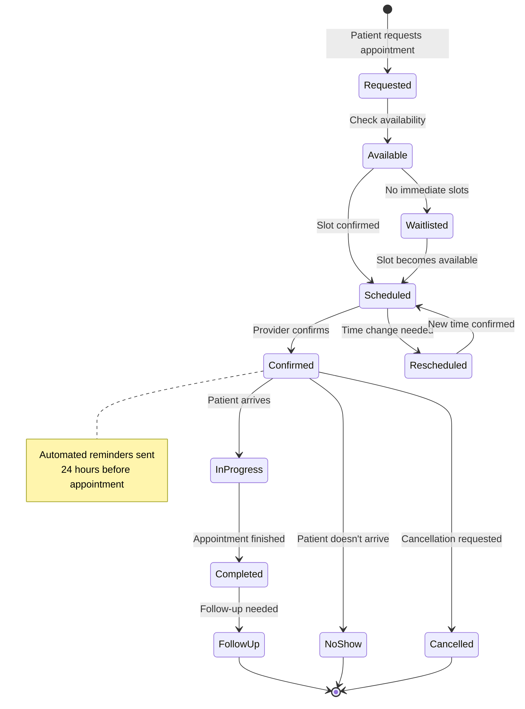

# 📊 Mermaid Diagrams Guide

This guide shows how to create beautiful, interactive diagrams in AgentCare documentation using Mermaid syntax.

## 🚀 Quick Start

Mermaid diagrams are written in code blocks with `mermaid` as the language:

````markdown

````

## 📋 Supported Diagram Types

### 1. Flowcharts - System Architecture

Perfect for showing AgentCare's multi-agent architecture:

```mermaid
graph TB
    subgraph "🏥 Healthcare Organization"
        Patient[👤 Patient]
        Doctor[👨‍⚕️ Doctor]
        Admin[👔 Administrator]
    end
    
    subgraph "🤖 AgentCare System"
        API[🔧 Backend API]
        Frontend[🖥️ React Frontend]
        
        subgraph "AI Agents"
            Supervisor[🧠 Supervisor]
            Booking[📅 Booking]
            FAQ[❓ FAQ]
        end
        
        Database[(🗄️ PostgreSQL)]
        LLM[🤖 Ollama LLM]
    end
    
    Patient --> Frontend
    Doctor --> Frontend
    Admin --> Frontend
    
    Frontend --> API
    API --> Supervisor
    Supervisor --> Booking
    Supervisor --> FAQ
    
    Booking --> Database
    FAQ --> Database
    Supervisor --> LLM
    
    classDef healthcare fill:#2c5aa0,stroke:#1e3a5f,color:#fff
    classDef system fill:#4a90c2,stroke:#2c5aa0,color:#fff
    classDef ai fill:#fd7e14,stroke:#e85d04,color:#fff
    classDef data fill:#28a745,stroke:#1e7e34,color:#fff
    
    class Patient,Doctor,Admin healthcare
    class API,Frontend system
    class Supervisor,Booking,FAQ ai
    class Database,LLM data
```



### 2. Sequence Diagrams - API Interactions

Show how components interact over time:

```mermaid
sequenceDiagram
    participant U as 👤 User
    participant F as 🖥️ Frontend
    participant S as 🤖 Supervisor Agent
    participant A as 📅 Availability Agent
    participant D as 🗄️ Database
    participant L as 🧠 Ollama LLM
    
    U->>F: "Book appointment with cardiologist"
    F->>S: POST /api/v1/agents/process
    
    S->>L: Analyze intent
    L-->>S: Intent: "booking", Entity: "cardiologist"
    
    S->>A: Delegate to Availability Agent
    A->>D: Query available cardiologists
    D-->>A: Return available slots
    
    A->>L: Generate response with options
    L-->>A: Formatted availability response
    
    A-->>S: Available appointments
    S-->>F: JSON response with options
    F-->>U: Display available appointments
    
    Note over U,L: Multi-agent coordination with<br/>natural language processing
```



### 3. Entity Relationship Diagrams - Database Schema

Visualize database relationships:


### 4. State Diagrams - Appointment Workflow

Show state transitions in healthcare workflows:



### 5. Gantt Charts - Project Timeline

Track development and deployment phases:


### 6. Class Diagrams - Agent Architecture

Show object-oriented design:


## 🎨 Healthcare Theme Colors

Our Mermaid setup includes healthcare-themed colors:

- **Primary Blue**: `#2c5aa0` - Main healthcare branding
- **Agent Blue**: `#4a90c2` - AI agents and systems
- **Success Green**: `#28a745` - Database and successful states
- **Warning Orange**: `#fd7e14` - AI/LLM components
- **Info Purple**: `#6f42c1` - User interactions

### Using Custom Classes

Add healthcare-specific styling to your diagrams:


## 📱 Responsive Design

All diagrams are automatically responsive and include:
- Mobile-friendly scaling
- Touch-friendly interactions
- Dark mode support
- Accessibility features

## 🔧 Advanced Features

### Subgraphs for Organization

Use subgraphs to group related components:


### Interactive Elements

Mermaid diagrams support click events and tooltips:


## 💡 Best Practices

1. **Keep It Simple**: Focus on the essential information
2. **Use Consistent Colors**: Stick to healthcare theme colors
3. **Add Context**: Use subgraphs to group related items
4. **Responsive Design**: Test on different screen sizes
5. **Accessibility**: Use meaningful labels and descriptions

## 📞 Support

For Mermaid-specific issues:
- [Mermaid Documentation](https://mermaid-js.github.io/mermaid/)
- [Mermaid Live Editor](https://mermaid.live/) - Test diagrams
- [GitHub Issues](https://github.com/mermaid-js/mermaid/issues) - Report bugs

---

**🏥 Beautiful Diagrams for Healthcare Documentation**  
*Enhancing technical communication with visual clarity* 