# 📚 Knowledge Base Reference

**Complete collection of all README content for comprehensive reference**

This knowledge base contains all README content from the AgentCare project, organized for easy access and comprehensive reference.

## 📖 Complete README Collection

### **🏠 Main Project READMEs**

#### [🏥 Main README Reference](main-readme)
The primary project README containing:
- Quick start guide and one-command setup
- System overview with multi-agent AI architecture
- Healthcare platform features and HIPAA compliance
- Essential commands and development shortcuts
- Support and contribution information

#### [📚 Documentation README Reference](docs-readme)
Comprehensive documentation guide containing:
- Complete navigation structure
- Role-based quick start paths (Developers, DevOps, Healthcare IT, Project Managers)
- Documentation categories and organization
- System overview and feature breakdown
- Essential commands and healthcare features

### **🔧 Quick Reference Links**

**Essential Access Points:**
- **[Main Documentation Hub](../)** - Central documentation navigation
- **[Setup Guides](../setup/)** - Installation and configuration
- **[Operations Guides](../operations/)** - Monitoring and deployment
- **[Architecture Guides](../architecture/)** - System design and patterns
- **[Testing Guides](../testing/)** - Quality assurance and testing
- **[Reference Guides](../guides/)** - User management and workflows

## 🎯 Knowledge Base Structure

### **📋 Content Organization**

```mermaid
graph TB
    subgraph "🏥 AgentCare Knowledge Base"
        KB[📚 Knowledge Base Hub]
        
        subgraph "📖 README Collection"
            MainREADME[🏠 Main README<br/>Project Overview]
            DocsREADME[📚 Docs README<br/>Navigation Guide]
        end
        
        subgraph "📚 Documentation Sections"
            Setup[🚀 Setup Guides]
            Operations[🛠️ Operations]
            Architecture[🏗️ Architecture]
            Testing[🧪 Testing]
            Guides[📖 Reference]
        end
        
        subgraph "🔍 Quick Access"
            Commands[⚡ Essential Commands]
            Paths[🎯 Quick Start Paths]
            Features[🏥 Healthcare Features]
        end
    end
    
    KB --> MainREADME
    KB --> DocsREADME
    
    MainREADME --> Setup
    DocsREADME --> Operations
    DocsREADME --> Architecture
    DocsREADME --> Testing
    DocsREADME --> Guides
    
    MainREADME --> Commands
    DocsREADME --> Paths
    MainREADME --> Features
    
    classDef kb fill:#2c5aa0,stroke:#1e3a5f,color:#fff
    classDef readme fill:#4a90c2,stroke:#2c5aa0,color:#fff
    classDef docs fill:#28a745,stroke:#1e7e34,color:#fff
    classDef access fill:#fd7e14,stroke:#e85d04,color:#fff
    
    class KB kb
    class MainREADME,DocsREADME readme
    class Setup,Operations,Architecture,Testing,Guides docs
    class Commands,Paths,Features access
```

### **🚀 Information Categories**

#### **🏗️ System Architecture Knowledge**
- Multi-agent AI system design
- Healthcare platform features
- Production-ready infrastructure
- HIPAA compliance and security

#### **⚡ Quick Start Information**
- One-command setup procedures
- Essential development commands
- Role-based learning paths
- Common troubleshooting guides

#### **🏥 Healthcare Domain Knowledge**
- Multi-tenant organization support
- 24+ healthcare user types
- Clinical workflow integration
- Regulatory compliance features

#### **🔧 Technical Implementation**
- Docker containerization details
- Database schema and vector support
- API endpoints and testing
- CI/CD and deployment strategies

## 🎯 How to Use This Knowledge Base

### **👨‍💻 For Developers**
1. Start with [Main README Reference](main-readme) for project overview
2. Review [Documentation README Reference](docs-readme) for navigation
3. Follow role-specific paths to detailed technical guides
4. Use quick command references for daily development

### **🔧 For DevOps Engineers**
1. Check deployment and setup information in both READMEs
2. Focus on Docker, system inspector, and monitoring content
3. Review multi-tenancy and security implementations
4. Use operational command references

### **🏥 For Healthcare IT**
1. Explore healthcare-specific features and compliance
2. Review user management and organizational support
3. Understand HIPAA compliance and data protection
4. Check system monitoring and health validation

### **📊 For Project Managers**
1. Get high-level system overview from main README
2. Review feature roadmap and project status
3. Understand user ecosystem and healthcare support
4. Check deployment and operational requirements

## 🔍 Search and Navigation Tips

### **Quick Navigation**
- Use the navigation menu to jump between sections
- Each README page has internal links to relevant documentation
- Cross-references between documents provide comprehensive coverage

### **Content Search**
- All content is searchable within GitHub Pages
- Use browser search (Ctrl+F) for specific terms
- Reference links provide direct access to detailed guides

### **Mobile Access**
- All knowledge base content is mobile-responsive
- Touch-friendly navigation and search
- Optimized reading experience on all devices

## 📞 Knowledge Base Support

### **Updating Content**
- README content is synchronized from main documentation
- Updates are made to source files and propagated to knowledge base
- Version control ensures consistency across all references

### **Finding Information**
- Start with the most relevant README for your role
- Use cross-references to dive deeper into specific topics
- Contact support if information is missing or unclear

### **Contributing**
- Suggest improvements to README content
- Report missing or outdated information
- Help improve documentation clarity and usefulness

---

**🏥 Comprehensive Knowledge Base**  
*All AgentCare README content organized for maximum accessibility and reference value*

**🚀 [Back to Documentation Home](../)** 