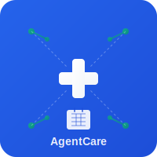
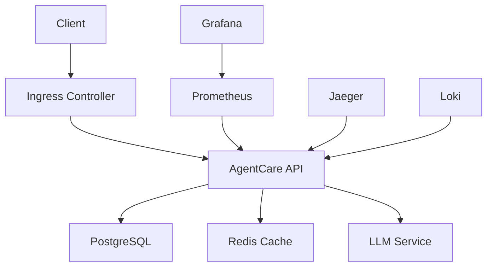

<div align="center">
  
  
  # 🏥 AgentCare - AI-Powered Healthcare Scheduling Platform
</div>


[](https://vishalm.github.io/agentcare/)
[](https://github.com/vishalm/agentcare/actions)
[](https://sonarcloud.io/summary/new_code?id=vishalm_agentcare)
[](https://hub.docker.com/r/agentcare/platform)
[](https://opensource.org/licenses/MIT)

> **Enterprise-grade multi-agent healthcare scheduling platform with AI coordination, HIPAA compliance, and real-time appointment management.**

## 🌟 Live Demo & Documentation

- **🚀 [Live Demo](https://vishalm.github.io/agentcare/)** - Interactive frontend demo
- **📚 [Documentation](https://vishalm.github.io/agentcare/docs/)** - Complete technical docs
- **🏗️ [Architecture Guide](docs/architecture/SYSTEM_ARCHITECTURE.md)** - System diagrams
- **🔧 [API Documentation](docs/api-reference.md)** - RESTful API reference

## 🎯 Key Features

### 🤖 Multi-Agent AI System
- **Supervisor Agent** - Orchestrates and coordinates all agent activities
- **Booking Agent** - Handles appointment scheduling and modifications
- **Availability Agent** - Manages provider schedules and time slots
- **FAQ Agent** - Provides intelligent responses using RAG system

### 🏥 Healthcare-Specific Features
- **HIPAA Compliance** - Secure handling of protected health information
- **Provider Management** - Comprehensive healthcare provider profiles
- **Appointment Scheduling** - Real-time availability and booking
- **Patient Portal** - User-friendly interface for patients

### 🧠 AI & LLM Integration
- **Ollama Integration** - Local LLM processing with Qwen 2.5 and DeepSeek R1
- **RAG System** - Vector-based conversation memory and knowledge retrieval
- **Natural Language Processing** - Intelligent understanding of user requests
- **Context Awareness** - Maintains conversation context across interactions

### 🛡️ Enterprise Security
- **JWT Authentication** - Secure token-based authentication
- **Role-Based Access Control** - Granular permission management
- **Rate Limiting** - API protection against abuse
- **Audit Logging** - Comprehensive activity tracking

## 🚀 Quick Start

### Prerequisites
- **Node.js** 22+ and npm 10+
- **Docker** and Docker Compose
- **PostgreSQL** 14+
- **Redis** 7+
- **Ollama** for AI features

### 1. Clone and Setup
```bash
git clone https://github.com/vishalm/agentcare.git
cd agentcare
npm run setup
```

### 2. Environment Configuration
```bash
cp env.example .env
# Edit .env with your configuration
```

### 3. Start Development Environment
```bash
# Start all services with Docker Compose
docker-compose up

# Or start services individually
npm run dev:backend  # Backend API (port 3000)
npm run dev:frontend # Frontend UI (port 3001)
```

### 4. Initialize Database
```bash
npm run db:setup
npm run db:seed  # Optional: add demo data
```

### 5. Start Ollama (for AI features)
```bash
ollama serve
ollama pull qwen2.5:latest
```

## 📁 Project Structure

```
agentcare/
├── 📱 frontend/              # React + TypeScript + Vite
│   ├── src/components/       # React components
│   ├── src/pages/           # Page components
│   ├── src/store/           # State management
│   └── public/              # Static assets
├── 🔧 backend/               # Node.js + Express + TypeScript
│   ├── src/agents/          # AI agents
│   ├── src/controllers/     # API controllers
│   ├── src/services/        # Business logic
│   └── src/tools/           # Agent tools
├── 🗄️ database/              # PostgreSQL schemas
├── 🏗️ infrastructure/        # Docker, K8s, CI/CD
├── 📚 docs/                  # Documentation
├── 🧪 tests/                 # Test suites
└── 📜 scripts/               # Automation scripts
```

👉 **[Complete Project Structure Guide](docs/PROJECT_STRUCTURE.md)**

## 🏗️ Architecture Overview

<div class="mermaid">
graph TB
    subgraph "Frontend Layer"
        React[React App]
        UI[Material-UI]
        Store[Zustand Store]
    end
    
    subgraph "API Layer"
        Express[Express Server]
        Auth[JWT Auth]
        Rate[Rate Limiting]
    end
    
    subgraph "Multi-Agent System"
        Supervisor[Supervisor Agent]
        Booking[Booking Agent]
        Availability[Availability Agent]
        FAQ[FAQ Agent]
    end
    
    subgraph "AI/LLM Layer"
        Ollama[Ollama LLM]
        RAG[RAG System]
        Knowledge[Knowledge Base]
    end
    
    subgraph "Data Layer"
        Postgres[(PostgreSQL)]
        Redis[(Redis Cache)]
    end
    
    React --> Express
    Express --> Supervisor
    Supervisor --> Booking
    Supervisor --> Availability
    Supervisor --> FAQ
    Supervisor --> Ollama
    Express --> Postgres
    Express --> Redis
</div>

👉 **[Detailed Architecture Diagrams](docs/architecture/diagrams/SYSTEM_ARCHITECTURE.md)**

## 🛠️ Development

### Available Scripts

```bash
# Development
npm run dev                   # Start full development stack
npm run dev:backend          # Backend only
npm run dev:frontend         # Frontend only

# Building
npm run build                # Build both frontend and backend
npm run build:backend        # Build backend only
npm run build:frontend       # Build frontend only

# Testing
npm run test                 # Run all tests
npm run test:unit           # Unit tests
npm run test:integration    # Integration tests
npm run test:ui             # E2E tests with Playwright

# Docker
npm run docker:build        # Build all Docker images
npm run docker:compose      # Start with Docker Compose
npm run docker:build:backend-standalone  # Backend container
npm run docker:build:frontend-standalone # Frontend container

# Quality
npm run lint                # ESLint
npm run type-check          # TypeScript
npm run format             # Prettier
npm run security:scan      # Security audit
```

### Technology Stack

#### Frontend
- **React 18** with TypeScript
- **Material-UI** for components
- **Zustand** for state management
- **React Query** for API calls
- **Vite** for fast development

#### Backend
- **Node.js** with Express
- **TypeScript** for type safety
- **PostgreSQL** database
- **Redis** for caching
- **JWT** authentication
- **Ollama** for AI/LLM

#### Infrastructure
- **Docker** containerization
- **Kubernetes** orchestration
- **GitHub Actions** CI/CD
- **SonarCloud** code quality
- **Prometheus** monitoring

## 🚀 Deployment

### Staging Environment
Comprehensive staging environment for testing and validation:

- **Frontend Staging**: https://staging-frontend.agentcare.dev
- **Backend API Staging**: https://staging-api.agentcare.dev
- **Health Check**: https://staging.agentcare.dev/health

```bash
# Deploy to staging (automated via CI/CD on main/develop branches)
./scripts/deploy-staging.sh all staging

# Deploy specific components
./scripts/deploy-staging.sh frontend staging
./scripts/deploy-staging.sh backend staging

# Local staging environment
docker-compose -f docker-compose.staging.yml up -d
```

👉 **[Staging Deployment Guide](docs/staging-deployment.md)**

### Docker Deployment
```bash
# Quick start with Docker Compose
docker-compose up -d

# Production deployment
npm run docker:prod

# Staging environment
docker-compose -f docker-compose.staging.yml up -d
```

### Kubernetes Deployment
```bash
# Deploy to Kubernetes
kubectl apply -f infrastructure/kubernetes/

# Or use Helm
helm install agentcare infrastructure/helm/agentcare
```

### GitHub Pages (Frontend Only)
The frontend is automatically deployed to GitHub Pages on every push to main:
- **URL**: https://vishalm.github.io/agentcare/
- **Auto-deployment**: Via GitHub Actions
- **Manual deployment**: `npm run deploy:pages`

👉 **[Detailed Deployment Guide](docs/operations/DEPLOYMENT_GUIDE.md)**

## 🧪 Testing

Comprehensive testing strategy with multiple test types:

- **Unit Tests**: Jest for component and function testing
- **Integration Tests**: API and database integration
- **Contract Tests**: API contract validation
- **E2E Tests**: Playwright for user journey testing
- **Performance Tests**: Load and stress testing

```bash
npm run test:all              # Run all test suites
npm run test:coverage         # Generate coverage report
npm run test:ci              # CI-optimized test run
```

## 📊 Monitoring & Observability

- **Health Checks**: `/health` endpoint for service monitoring
- **Metrics**: Prometheus metrics at `/metrics`
- **Logging**: Structured JSON logging with Winston
- **Tracing**: Request tracing for debugging
- **Alerts**: Configurable alerting rules

## 🔒 Security & Compliance

### HIPAA Compliance
- **Data Encryption**: At rest and in transit
- **Access Controls**: Role-based permissions
- **Audit Logging**: Complete activity tracking
- **Data Retention**: Configurable retention policies

### Security Features
- **JWT Authentication**: Secure token-based auth
- **Rate Limiting**: API protection
- **Input Validation**: Comprehensive data validation
- **CORS Configuration**: Secure cross-origin requests
- **Container Security**: Non-root containers with minimal attack surface

## 🤝 Contributing

We welcome contributions! Please see our [Contributing Guide](CONTRIBUTING.md) for details.

1. Fork the repository
2. Create a feature branch (`git checkout -b feature/amazing-feature`)
3. Commit your changes (`git commit -m 'Add amazing feature'`)
4. Push to the branch (`git push origin feature/amazing-feature`)
5. Open a Pull Request

### Development Guidelines
- Follow [TypeScript best practices](docs/guides/TYPESCRIPT_GUIDE.md)
- Write tests for new features
- Update documentation
- Follow [commit conventions](docs/guides/COMMIT_CONVENTIONS.md)

## 📚 Documentation

- **[Project Structure](docs/PROJECT_STRUCTURE.md)** - Complete codebase organization
- **[Architecture Guide](docs/architecture/ARCHITECTURE_GUIDE.md)** - System design and patterns
- **[API Reference](docs/api-reference.md)** - RESTful API documentation
- **[Setup Guide](docs/setup/QUICK_START.md)** - Detailed installation instructions
- **[Docker Guide](docs/setup/DOCKER_SETUP.md)** - Container deployment
- **[Testing Guide](docs/testing.md)** - Testing strategies and best practices

## 🏆 Features Roadmap

### Current Version (v3.0.0-beta)
- ✅ Multi-agent AI system
- ✅ Real-time appointment booking
- ✅ HIPAA-compliant architecture
- ✅ Docker containerization
- ✅ GitHub Actions CI/CD

### Planned Features
- 🔄 Advanced AI scheduling optimization
- 🔄 Mobile application (React Native)
- 🔄 Provider calendar integration
- 🔄 Telemedicine support
- 🔄 Analytics dashboard
- 🔄 Multi-language support

## 📈 Performance

- **Response Time**: < 100ms average API response
- **Availability**: 99.9% uptime target
- **Scalability**: Horizontal scaling with Kubernetes
- **Throughput**: 1000+ concurrent users supported
- **Database**: Optimized queries with connection pooling

## 📄 License

This project is licensed under the MIT License - see the [LICENSE](LICENSE) file for details.

## 🙏 Acknowledgments

- **Ollama** - Local LLM processing
- **Material-UI** - React component library  
- **PostgreSQL** - Robust database system
- **Docker** - Containerization platform
- **GitHub Actions** - CI/CD automation

---

## 📞 Support & Contact

- **GitHub Issues**: [Report bugs or request features](https://github.com/vishalm/agentcare/issues)
- **Documentation**: [Complete documentation site](https://vishalm.github.io/agentcare/)
- **Email**: vishal@agentcare.dev

---

<div align="center">

**🏥 Built with ❤️ for healthcare providers and patients**

[Live Demo](https://vishalm.github.io/agentcare/) • [Documentation](docs/) • [API Reference](docs/api-reference.md) • [Contributing](CONTRIBUTING.md)

</div>

**[🏠 Home](https://vishalm.github.io/agentcare/) • [🚀 Quick Start](https://vishalm.github.io/agentcare/docs/setup/QUICK_START.html) • [🏗️ Architecture](https://vishalm.github.io/agentcare/docs/architecture/ARCHITECTURE_GUIDE.html) • [🔧 API](https://vishalm.github.io/agentcare/docs/api-reference.html)**

# AgentCare - Multi-Agent Healthcare Scheduling System

## Kubernetes Architecture and Benefits

### Why Kubernetes for AgentCare?

1. **Scalability and High Availability**
   - Automatic horizontal scaling of agents based on load
   - Self-healing capabilities for failed components
   - Load balancing across multiple replicas
   - Zero-downtime deployments

2. **Resource Optimization**
   - Efficient resource allocation for AI agents
   - Automatic bin packing for optimal resource usage
   - Resource quotas and limits per component
   - Cost optimization through efficient scheduling

3. **Security and Compliance (HIPAA)**
   - Network policies for inter-agent communication
   - Secret management for sensitive data
   - RBAC for access control
   - Data encryption at rest and in transit
   - Audit logging and compliance tracking

4. **Monitoring and Observability**
   - Real-time metrics with Prometheus
   - Visual dashboards with Grafana
   - Distributed tracing with Jaeger
   - Centralized logging with Loki
   - Health checks and readiness probes

### System Components

1. **Core Services**
   ```
   - Main Application: NodePort 31780 (http://localhost:31780)
   - Health Endpoint: http://localhost:31780/health
   ```

2. **Databases**
   ```
   - PostgreSQL: agentcare-postgresql.agentcare.svc.cluster.local:5432
   - Redis Cache: agentcare-redis-master.agentcare.svc.cluster.local:6379
   ```

3. **Monitoring Stack**
   ```
   - Grafana: http://localhost:3000 (admin/admin123)
   - Prometheus: http://localhost:9090
   - Jaeger Tracing: http://localhost:16686
   ```

### Quick Start

1. **Prerequisites**
   ```bash
   # Required tools
   - Docker Desktop with Kubernetes enabled
   - Helm v3.0.0+
   - kubectl configured for local cluster
   ```

2. **Installation**
   ```bash
   # Clone the repository
   git clone https://github.com/vishalm/agentcare.git
   cd agentcare/infrastructure/helm/agentcare

   # Install with Helm
   helm install agentcare . -f values-dev.yaml --create-namespace --namespace agentcare
   ```

3. **Access Services**
   ```bash
   # Port forwarding for monitoring
   kubectl port-forward svc/agentcare-grafana 3000:80 -n agentcare &
   kubectl port-forward svc/agentcare-prometheus-server 9090:80 -n agentcare &
   ```

### Architecture Overview



### Component Details

1. **Agent Layer**
   - Supervisor Agent: Orchestrates other agents
   - Availability Agent: Manages scheduling slots
   - Booking Agent: Handles appointment scheduling
   - FAQ Agent: Manages patient queries

2. **Infrastructure Layer**
   - Kubernetes Deployments: Rolling updates
   - StatefulSets: Database persistence
   - ConfigMaps: Configuration management
   - Secrets: Sensitive data management

3. **Monitoring Layer**
   - Metrics Collection: Prometheus
   - Visualization: Grafana
   - Tracing: Jaeger
   - Logging: Loki + Promtail

### Development Workflow

1. **Local Development**
   ```bash
   # Start local environment
   helm install agentcare . -f values-dev.yaml --namespace agentcare

   # Access application
   open http://localhost:31780

   # Monitor logs
   kubectl logs -f deployment/agentcare -n agentcare
   ```

2. **Testing**
   ```bash
   # Run health check
   curl http://localhost:31780/health

   # Access monitoring
   open http://localhost:3000  # Grafana
   open http://localhost:9090  # Prometheus
   ```

### Kubernetes Benefits for Each Component

1. **AI Agents**
   - Isolated runtime environments
   - Automatic scaling based on load
   - Resource guarantees
   - Fault isolation

2. **Databases**
   - Automated backups
   - Data persistence
   - Automatic failover
   - Resource management

3. **Monitoring**
   - Centralized metrics collection
   - Automated alerting
   - Performance visualization
   - Distributed tracing

4. **Security**
   - Network isolation
   - Secret rotation
   - Access control
   - Audit logging

### Troubleshooting

1. **Common Commands**
   ```bash
   # Check pod status
   kubectl get pods -n agentcare

   # View logs
   kubectl logs -f deployment/agentcare -n agentcare

   # Check services
   kubectl get svc -n agentcare
   ```

2. **Health Verification**
   ```bash
   # System health
   curl http://localhost:31780/health

   # Component status
   kubectl describe pods -n agentcare
   ```

### Security Considerations

1. **HIPAA Compliance**
   - Encrypted data storage
   - Secure communication
   - Access logging
   - Data backup and recovery

2. **Network Security**
   - Pod-to-pod encryption
   - Network policies
   - Service mesh integration
   - TLS termination

### Maintenance and Updates

1. **Upgrade Process**
   ```bash
   # Update dependencies
   helm dependency update

   # Upgrade deployment
   helm upgrade agentcare . -f values-dev.yaml -n agentcare
   ```

2. **Backup Process**
   ```bash
   # Backup databases
   kubectl exec -n agentcare agentcare-postgresql-0 -- pg_dump -U agentcare_user agentcare
   ```

This Kubernetes-based architecture ensures that AgentCare operates as a robust, scalable, and secure healthcare scheduling system, maintaining HIPAA compliance while providing excellent observability and maintenance capabilities.

## 🏗️ Kubernetes Deployment

### Service Access URLs

#### Main Application
- **Frontend UI**: http://localhost:31781
- **AgentCare API**: http://localhost:31780
- **Health Check**: http://localhost:31780/health
- **API Documentation**: http://localhost:31780/api/docs

#### Monitoring Stack
- **Grafana**: http://localhost:31800
  - Username: admin
  - Password: admin123
  - Default Dashboards:
    - AgentCare Overview
    - Node Metrics
    - API Performance

- **Prometheus**: http://localhost:31790
  - Metrics: http://localhost:31790/metrics
  - Targets: http://localhost:31790/targets
  - Rules: http://localhost:31790/rules

- **AlertManager**: http://localhost:31791
  - Alerts: http://localhost:31791/#/alerts
  - Silences: http://localhost:31791/#/silences

#### Tracing & Debugging
- **Jaeger UI**: http://localhost:31810
  - Trace Search: http://localhost:31810/search
  - Dependencies: http://localhost:31810/dependencies
- **Jaeger Collector**: http://localhost:31811 (for trace ingestion)

#### Development Database Access
> ⚠️ Note: Database ports are exposed in development environment only. In production, use proper security measures.

- **PostgreSQL**:
  ```bash
  Host: localhost
  Port: 31820
  Database: agentcare
  Username: agentcare_user
  ```

- **Redis**:
  ```bash
  Host: localhost
  Port: 31830
  ```

### Port Ranges

We use dedicated port ranges for different service types:

```
Frontend Service:      31781
Application Services:  31780
Monitoring Services:   31790-31799
Visualization:        31800-31809
Tracing Services:     31810-31819
Database Services:    31820-31839 (dev only)
```

### Quick Access Commands

```bash
# Port forwarding shortcuts
kubectl -n agentcare port-forward svc/agentcare 3000:3000 &                    # Main App
kubectl -n agentcare port-forward svc/agentcare-grafana 3001:3001 &           # Grafana
kubectl -n agentcare port-forward svc/agentcare-prometheus-server 9090:9090 &  # Prometheus
kubectl -n agentcare port-forward svc/agentcare-jaeger-query 16686:16686 &    # Jaeger

# View service status
kubectl get svc -n agentcare

# View pod status
kubectl get pods -n agentcare

# View logs
kubectl logs -f deployment/agentcare -n agentcare                              # Main App
kubectl logs -f deployment/agentcare-grafana -n agentcare                      # Grafana
kubectl logs -f deployment/agentcare-prometheus-server -n agentcare            # Prometheus
```

### Health Checks

Monitor service health using:

```bash
# Main application health
curl http://localhost:31780/health

# Prometheus targets health
curl http://localhost:31790/api/v1/targets

# Grafana health
curl http://localhost:31800/api/health

# Jaeger health
curl http://localhost:31810/health
```

### Ingress Access

If using ingress (enabled by default):

```bash
http://localhost/             # Main application
http://localhost/grafana      # Grafana
http://localhost/prometheus   # Prometheus
http://localhost/jaeger      # Jaeger UI
```

### Development vs Production

#### Development Environment
- All services exposed via NodePorts
- Database ports accessible
- Debug logging enabled
- Mock data available
- Minimal resource requests

#### Production Environment
- Services exposed through Ingress only
- Databases accessible internally only
- HIPAA compliance enabled
- Full monitoring and alerting
- Resource limits enforced

### Troubleshooting

Common issues and solutions:

1. **Service Not Accessible**
   ```bash
   # Check service status
   kubectl get svc -n agentcare
   
   # Check pod status
   kubectl get pods -n agentcare
   
   # Check pod logs
   kubectl logs -f <pod-name> -n agentcare
   ```

2. **Database Connection Issues**
   ```bash
   # Check database pods
   kubectl get pods -n agentcare | grep postgresql
   kubectl get pods -n agentcare | grep redis
   
   # Check database services
   kubectl get svc -n agentcare | grep postgresql
   kubectl get svc -n agentcare | grep redis
   ```

3. **Monitoring Issues**
   ```bash
   # Check Prometheus targets
   curl http://localhost:31790/api/v1/targets
   
   # Check Grafana datasources
   curl http://localhost:31800/api/datasources
   ```