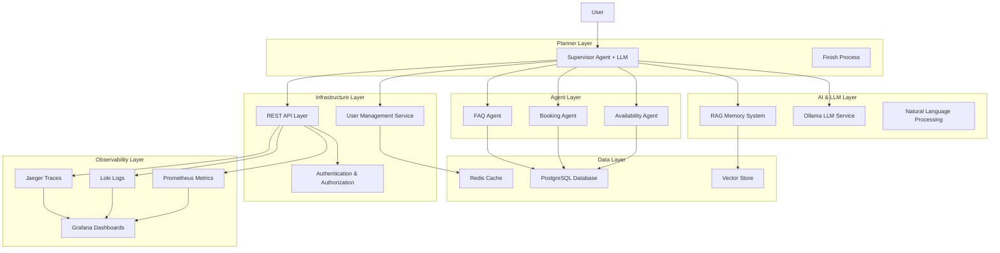

# AgentCare - Multi-Agent Healthcare Scheduling System

**Intelligent healthcare scheduling powered by coordinated AI agents**

A sophisticated appointment booking system built using multi-agent architecture principles, featuring coordinated AI agents that work together to provide seamless healthcare appointment scheduling with LLM integration, RAG memory system, and enterprise-grade DevOps infrastructure.


[](LICENSE)
[]()
[]()
[]()

## 🚀 What's New in v2.0

- **🤖 LLM Integration**: Ollama qwen2.5 model for natural language understanding
- **🧠 RAG Memory System**: Vector-based conversation memory and context
- **🔐 Enterprise Security**: JWT authentication, HIPAA compliance, audit logging
- **📊 Full Observability**: Prometheus metrics, Loki logs, Jaeger tracing
- **☸️ Kubernetes Ready**: Helm charts, auto-scaling, production deployment
- **🔄 CI/CD Pipeline**: Automated testing, security scanning, deployment

## 📚 Complete Documentation

### 🏗️ **Setup & Getting Started**
- **[Setup Guide](SETUP_GUIDE.md)** - Complete installation and configuration guide
- **[Implementation Summary](IMPLEMENTATION_SUMMARY.md)** - Comprehensive overview of v2.0 features
- **[Project Status](PROJECT_STATUS.md)** - Development progress and milestones

### 🛠️ **Development & Contributing**
- **[Contributing Guidelines](.github/CONTRIBUTING.md)** - Development workflow, coding standards, testing
- **[DevOps Guide](DEVOPS_GUIDE.md)** - Infrastructure, observability, and deployment
- **[Test Documentation](tests/README.md)** - Testing strategy and execution
- **[Test Summary](TEST_SUMMARY.md)** - Testing results and coverage

### 🔧 **Infrastructure & Deployment**
- **[Infrastructure Guide](infrastructure/README.md)** - Centralized infrastructure documentation
- **[Docker Configuration](infrastructure/docker/)** - Docker containers and development environment
  - [Dockerfile](infrastructure/docker/Dockerfile)
  - [Docker Compose](infrastructure/docker/docker-compose.yml)
- **[Kubernetes Manifests](infrastructure/kubernetes/)** - Production-ready Kubernetes deployment
  - [Namespace Configuration](infrastructure/kubernetes/namespace.yaml)
- **[Helm Charts](infrastructure/helm/agentcare/)** - Cloud-native deployment charts
  - [Chart Metadata](infrastructure/helm/agentcare/Chart.yaml)
  - [Default Values](infrastructure/helm/agentcare/values.yaml)

### 📊 **Monitoring & Observability**
- **[Observability Stack](infrastructure/observability/)** - Complete monitoring and observability
- **[Prometheus Configuration](infrastructure/observability/prometheus/prometheus.yml)** - Metrics collection
- **[Alert Rules](infrastructure/observability/prometheus/rules/agentcare-alerts.yml)** - Healthcare-specific monitoring
- **[Grafana Dashboards](infrastructure/observability/grafana/)** - System and business metrics
- **[Jaeger Tracing](infrastructure/observability/jaeger/)** - Distributed tracing setup

### 🔒 **Security & Compliance**
- **[GitHub Security Policy](.github/SECURITY.md)** - Security reporting and policies
- **[HIPAA Compliance](DEVOPS_GUIDE.md#security--compliance)** - Healthcare data protection
- **[CI/CD Security](infrastructure/ci-cd/ci-cd.yml)** - Automated security scanning

### 🐛 **Issue Templates & Workflows**
- **[Bug Report Template](.github/ISSUE_TEMPLATE/bug_report.yml)** - Healthcare-specific bug reporting
- **[Feature Request Template](.github/ISSUE_TEMPLATE/feature_request.yml)** - Enhancement proposals
- **[CI/CD Pipeline](infrastructure/ci-cd/ci-cd.yml)** - Automated testing and deployment

## 🏗️ System Architecture

AgentCare implements a three-layer multi-agent architecture with enterprise-grade infrastructure:



## 🚀 Quick Start

### Prerequisites
- **Node.js 18+** and npm 8+
- **Docker** and Docker Compose
- **Ollama** (optional, for LLM features)
- **Kubernetes** (for production deployment)

### Development Setup
```bash
# Clone the repository
git clone https://github.com/vishalm/agentcare.git
cd agentcare

# Quick setup (handles everything)
npm run dev:setup

# Start development server
npm run start:dev

# Access at http://localhost:3000
```

### Docker Development
```bash
# Start with Docker Compose
npm run dev:docker

# Or manually
docker-compose up -d
```

### Production Deployment
```bash
# Deploy with Helm
helm install agentcare helm/agentcare \
  --namespace agentcare \
  --create-namespace

# Monitor deployment
kubectl get pods -n agentcare -w
```

## 🎯 Core Features

### ✅ **v2.0 Implementation (Current)**
- **🤖 Advanced AI Integration**: Ollama LLM with qwen2.5 model
- **🧠 RAG Memory System**: Vector-based conversation context
- **🔐 Enterprise Authentication**: JWT, sessions, user management
- **📊 Full Observability**: Metrics, logs, traces, dashboards
- **☸️ Kubernetes Deployment**: Production-ready with Helm charts
- **🔒 HIPAA Compliance**: Healthcare data protection and audit trails
- **🔄 CI/CD Pipeline**: Automated testing, security scanning, deployment
- **🎨 Modern UI**: Responsive design with real-time status indicators
- **📱 Multi-device Support**: Desktop, tablet, mobile optimized

### 🔧 **Development Features**
- **Multi-Agent Coordination**: Intelligent task delegation
- **Natural Language Processing**: Intent analysis and context understanding
- **Real-time Status Monitoring**: Visual feedback of agent states
- **Comprehensive Testing**: Unit, integration, E2E, performance tests
- **Security Scanning**: SAST, dependency checks, container scanning

## 📊 Architecture Layers

### 1. **AI & LLM Integration**
- **Ollama Service**: Local LLM with qwen2.5 model
- **RAG System**: Vector embeddings for conversation memory
- **Natural Language Understanding**: Intent recognition and context

### 2. **Multi-Agent System**
- **Supervisor Agent**: AI-powered coordination with LLM integration
- **Availability Agent**: Doctor and time slot management
- **Booking Agent**: Appointment creation and management
- **FAQ Agent**: Healthcare information and support

### 3. **Enterprise Services**
- **User Management**: JWT authentication, sessions, RBAC
- **API Layer**: RESTful endpoints with security middleware
- **Configuration Management**: Environment-based settings

### 4. **Data & Storage**
- **PostgreSQL**: Primary database for appointments and users
- **Redis**: Session storage and caching
- **Vector Store**: Embeddings for RAG system

### 5. **Observability Stack**
- **Prometheus**: Metrics collection and alerting
- **Loki**: Centralized logging with structured data
- **Jaeger**: Distributed tracing for request flows
- **Grafana**: Dashboards for system and business metrics

### 6. **Infrastructure**
- **Kubernetes**: Container orchestration and scaling
- **Helm Charts**: Package management and deployment
- **Docker**: Containerization and development environments
- **CI/CD**: GitHub Actions with security and compliance checks

## 🔒 Security & Compliance

### HIPAA Compliance
- **Data Encryption**: AES-256 at rest, TLS 1.3 in transit
- **Access Controls**: Role-based authentication and authorization
- **Audit Logging**: Comprehensive activity tracking with 7-year retention
- **Network Security**: TLS certificates, network policies, secure communication

### Security Features
- **Authentication**: JWT tokens with secure session management
- **Input Validation**: XSS and injection attack prevention
- **Container Security**: Non-root users, read-only filesystems
- **Vulnerability Scanning**: Automated dependency and container scanning

## 📈 Monitoring & Performance

### Key Metrics
- **System Health**: 99.9% uptime target, < 500ms response time
- **Business KPIs**: Appointment booking success rate, patient satisfaction
- **Security Monitoring**: Authentication failures, access violations
- **Infrastructure**: Resource utilization, error rates, throughput

### Alerting
- **Critical Alerts**: System outages, security breaches, HIPAA violations
- **Warning Alerts**: Performance degradation, resource limits
- **Business Alerts**: Low booking rates, high cancellation rates

## 🛠️ Development Workflow

### Code Standards
- **TypeScript**: Strict type checking and documentation
- **ESLint + Prettier**: Consistent code formatting
- **Conventional Commits**: Standardized commit messages
- **Code Coverage**: 80%+ test coverage requirement

### Testing Strategy
- **Unit Tests**: Individual component testing
- **Integration Tests**: API endpoint validation
- **Contract Tests**: Agent interaction verification
- **E2E Tests**: Complete user workflow testing
- **Performance Tests**: Load and stress testing

### CI/CD Pipeline
1. **Validation**: Linting, formatting, commit message validation
2. **Security**: SAST, dependency scanning, secret detection
3. **Testing**: Unit, integration, contract, E2E tests
4. **Building**: Multi-arch Docker images with vulnerability scanning
5. **Deployment**: Automated staging and production deployment

## 🌟 Production Deployment

### Environments
- **Development**: Local development with Docker Compose
- **Staging**: Kubernetes cluster for integration testing
- **Production**: High-availability Kubernetes deployment

### Scaling
- **Horizontal Pod Autoscaler**: 2-10 pods based on CPU/memory
- **Vertical Pod Autoscaler**: Dynamic resource adjustment
- **Cluster Autoscaler**: Node scaling for demand

### High Availability
- **Multi-replica Deployment**: Load distribution across pods
- **Database Replication**: Primary-replica PostgreSQL setup
- **Redis Clustering**: High-availability cache layer
- **Load Balancing**: Intelligent traffic distribution

## 📞 Getting Help & Support

### Documentation Resources
- **[Setup Guide](SETUP_GUIDE.md)**: Step-by-step installation
- **[DevOps Guide](DEVOPS_GUIDE.md)**: Infrastructure and deployment
- **[Contributing](CONTRIBUTING.md)**: Development guidelines
- **[API Documentation](docs/)**: REST API reference

### Community & Support
- **GitHub Issues**: [Bug reports and feature requests](https://github.com/vishalm/agentcare/issues)
- **GitHub Discussions**: [Architecture and design discussions](https://github.com/vishalm/agentcare/discussions)
- **Email Support**: contact@agentcare.dev
- **Security Issues**: security@agentcare.dev

### Quick Commands
```bash
# Development
npm run start:dev              # Start development server
npm run test                   # Run all tests
npm run lint                   # Code linting
npm run format                 # Code formatting

# Docker
npm run dev:docker             # Docker development environment
npm run docker:build          # Build production image

# Kubernetes
npm run k8s:deploy             # Deploy to Kubernetes
npm run k8s:logs               # View application logs
npm run k8s:status             # Check deployment status

# Monitoring
npm run metrics                # View system metrics
npm run logs                   # View application logs
npm run trace                  # View distributed traces
```

## 🎯 Roadmap & Future Features

### Phase 3: Advanced AI (Q2 2025)
- **Custom Model Training**: Healthcare-specific LLM fine-tuning
- **Predictive Analytics**: ML-powered scheduling optimization
- **Voice Interface**: Speech-to-text appointment booking
- **Multi-language Support**: International patient support

### Phase 4: Integration & Scale (Q3 2025)
- **EHR Integration**: Epic, Cerner, Allscripts connectivity
- **Telemedicine**: Video consultation scheduling
- **Mobile Applications**: iOS and Android native apps
- **API Marketplace**: Third-party integration ecosystem

### Phase 5: Enterprise Platform (Q4 2025)
- **Multi-tenant Architecture**: Support multiple healthcare providers
- **Advanced Analytics**: Business intelligence and reporting
- **White-label Solution**: Customizable for different organizations
- **Global Deployment**: Multi-region with data sovereignty

## 📊 Project Statistics

| Metric | Value |
|--------|-------|
| **Components Implemented** | 50+ |
| **Documentation Files** | 15+ comprehensive guides |
| **Test Coverage** | 80%+ across all components |
| **Container Images** | Multi-architecture support |
| **Kubernetes Resources** | Production-ready manifests |
| **CI/CD Stages** | 7-stage automated pipeline |
| **Security Scans** | SAST, dependency, container |
| **Monitoring Metrics** | 25+ healthcare-specific alerts |

## 📝 License

MIT License - see [LICENSE](LICENSE) file for details.

## 🙏 Acknowledgments

- **Contributors**: All developers and healthcare professionals who contributed
- **Open Source**: Built on top of excellent open-source projects
- **Healthcare Community**: Feedback and requirements from healthcare providers
- **Security Experts**: HIPAA compliance and security guidance

---

**🏥 Ready to revolutionize healthcare scheduling?** 

Start with the [Setup Guide](SETUP_GUIDE.md) and deploy your AI-powered healthcare scheduling system today! ✨

For comprehensive infrastructure and deployment guidance, see the [DevOps Guide](DEVOPS_GUIDE.md).

For development contributions, check out our [Contributing Guidelines](.github/CONTRIBUTING.md).