# AgentCare - Multi-Agent Healthcare Scheduling System

**Intelligent healthcare scheduling powered by coordinated AI agents**

A sophisticated appointment booking system built using multi-agent architecture principles, featuring coordinated AI agents that work together to provide seamless healthcare appointment scheduling.


[](LICENSE)
[]()

## 🏗️ System Architecture

AgentCare implements a three-layer multi-agent architecture designed for scalability and intelligent task coordination:

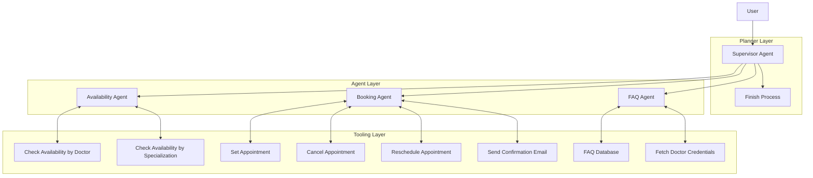

## 🔄 Agent Coordination Flow

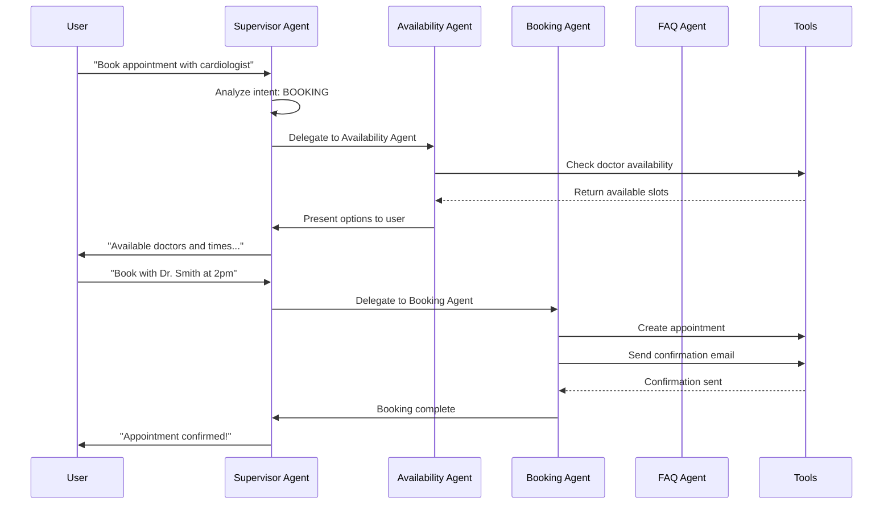

## 🚀 Quick Start

### Prerequisites
- Modern web browser (Chrome, Firefox, Safari, Edge)
- No additional dependencies required for demo version
- Web server recommended for production deployment

### Installation
```bash
# Clone the repository
git clone https://github.com/vishalm/agentcare.git
cd agentcare

# For development - serve locally
python -m http.server 8000
# or
npx http-server

# Access at http://localhost:8000
```

## 📊 Data Flow Architecture

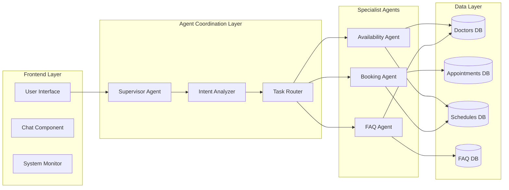

## 🎯 Core Features

### ✅ Current Implementation (v1.0-alpha)
- **Multi-Agent Coordination**: Intelligent task delegation between specialized agents
- **Real-time Status Monitoring**: Visual feedback of agent states and tool usage
- **Natural Language Processing**: Intent analysis and context understanding
- **Responsive UI**: Works seamlessly across devices
- **Mock Data Integration**: Realistic demo with sample doctors and appointments

### 🔧 Development Roadmap

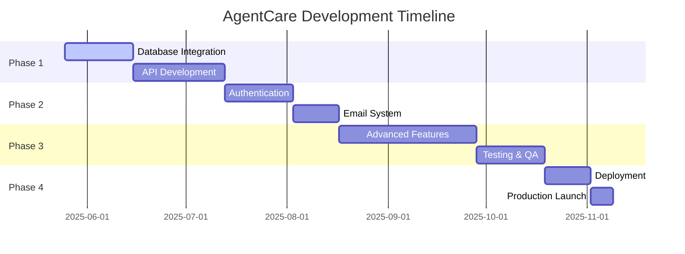

## 🗄️ Database Schema Design

### Entity Relationship Diagram
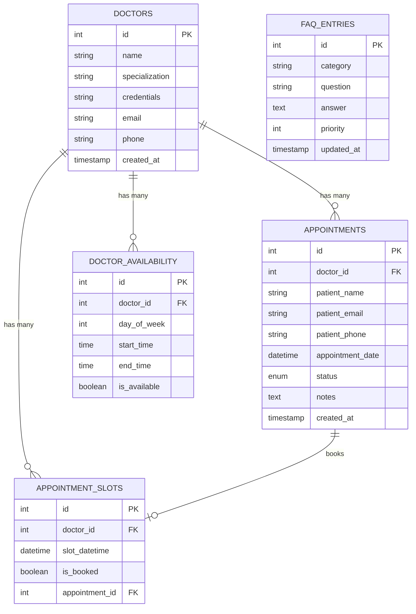

### Database Implementation
```sql
-- Core tables for AgentCare
CREATE TABLE doctors (
    id INT PRIMARY KEY AUTO_INCREMENT,
    name VARCHAR(255) NOT NULL,
    specialization VARCHAR(100) NOT NULL,
    credentials TEXT,
    email VARCHAR(255) UNIQUE,
    phone VARCHAR(20),
    created_at TIMESTAMP DEFAULT CURRENT_TIMESTAMP
);

CREATE TABLE appointments (
    id INT PRIMARY KEY AUTO_INCREMENT,
    doctor_id INT NOT NULL,
    patient_name VARCHAR(255) NOT NULL,
    patient_email VARCHAR(255) NOT NULL,
    patient_phone VARCHAR(20),
    appointment_date DATETIME NOT NULL,
    status ENUM('scheduled', 'cancelled', 'completed', 'no_show') DEFAULT 'scheduled',
    notes TEXT,
    created_at TIMESTAMP DEFAULT CURRENT_TIMESTAMP,
    FOREIGN KEY (doctor_id) REFERENCES doctors(id)
);

CREATE TABLE doctor_availability (
    id INT PRIMARY KEY AUTO_INCREMENT,
    doctor_id INT NOT NULL,
    day_of_week INT NOT NULL, -- 0=Sunday, 1=Monday, etc.
    start_time TIME NOT NULL,
    end_time TIME NOT NULL,
    is_available BOOLEAN DEFAULT TRUE,
    FOREIGN KEY (doctor_id) REFERENCES doctors(id)
);

-- Indexes for performance
CREATE INDEX idx_appointments_date ON appointments(appointment_date);
CREATE INDEX idx_appointments_doctor ON appointments(doctor_id, appointment_date);
CREATE INDEX idx_availability_doctor_day ON doctor_availability(doctor_id, day_of_week);
```

## 🔌 API Architecture

### RESTful API Design
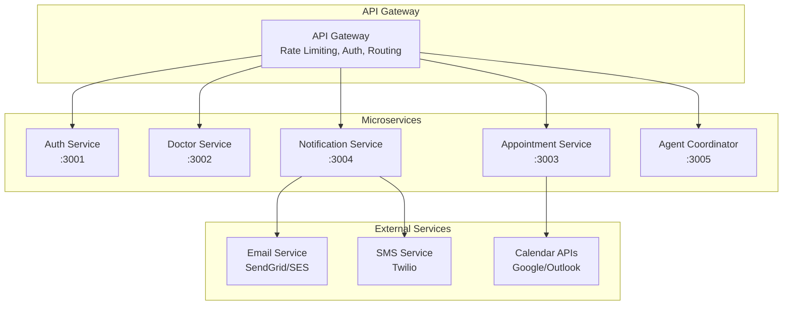

### API Endpoints Specification

#### Doctor Management
```http
GET    /api/v1/doctors                    # List all doctors
GET    /api/v1/doctors/:id                # Get doctor details
GET    /api/v1/doctors/specialization/:spec # Doctors by specialization
POST   /api/v1/doctors                    # Create doctor (admin)
PUT    /api/v1/doctors/:id                # Update doctor (admin)
DELETE /api/v1/doctors/:id                # Remove doctor (admin)
```

#### Availability Management
```http
GET    /api/v1/availability/:doctorId     # Doctor availability
GET    /api/v1/availability/date/:date    # All doctors for specific date
POST   /api/v1/availability              # Update doctor availability
GET    /api/v1/slots/available           # Get available time slots
```

#### Appointment Management
```http
POST   /api/v1/appointments               # Create appointment
GET    /api/v1/appointments/:id           # Get appointment details
PUT    /api/v1/appointments/:id           # Update appointment
DELETE /api/v1/appointments/:id           # Cancel appointment
GET    /api/v1/appointments/patient/:email # Patient's appointments
```

#### Agent Coordination
```http
POST   /api/v1/agents/process             # Process user message
GET    /api/v1/agents/status              # Get agent status
POST   /api/v1/agents/reset               # Reset conversation
```

## 🔒 Security Architecture

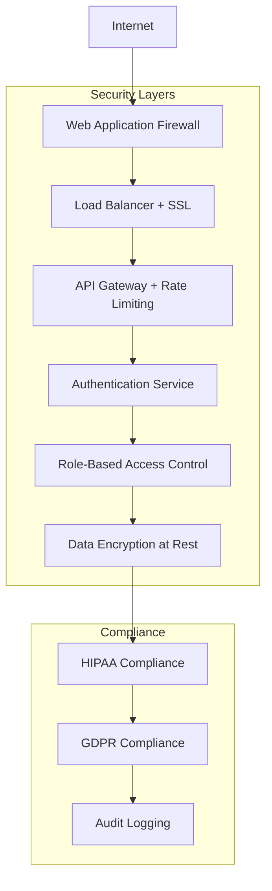

### Security Implementation Checklist
- [ ] **HTTPS Everywhere**: SSL/TLS certificates
- [ ] **Input Sanitization**: Prevent XSS and injection attacks
- [ ] **Authentication**: JWT-based user authentication
- [ ] **Authorization**: Role-based access control (RBAC)
- [ ] **Data Encryption**: Encrypt PHI (Protected Health Information)
- [ ] **Audit Logging**: Track all system access and changes
- [ ] **Rate Limiting**: Prevent API abuse and DDoS
- [ ] **HIPAA Compliance**: Healthcare data protection standards
- [ ] **Vulnerability Scanning**: Regular security assessments

## 🧪 Testing Strategy

### Testing Pyramid
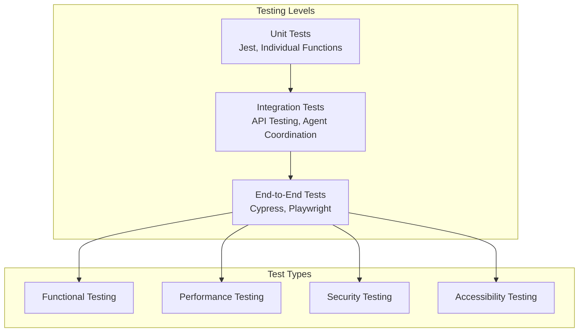

### Test Implementation Examples
```javascript
// Unit Test Example - Supervisor Agent
describe('SupervisorAgent', () => {
    let supervisor;
    
    beforeEach(() => {
        supervisor = new SupervisorAgent();
    });
    
    test('should recognize booking intent correctly', () => {
        const intent = supervisor.analyzeIntent('I want to book an appointment');
        expect(intent.type).toBe('booking');
        expect(intent.confidence).toBeGreaterThan(0.8);
    });
    
    test('should delegate to availability agent for booking requests', () => {
        const mockSystem = { switchAgent: jest.fn() };
        supervisor.system = mockSystem;
        
        supervisor.delegateToAvailability('book appointment', { type: 'booking' });
        expect(mockSystem.switchAgent).toHaveBeenCalledWith('availability');
    });
});

// Integration Test Example - API Endpoints
describe('Appointment API', () => {
    test('should create appointment successfully', async () => {
        const response = await request(app)
            .post('/api/v1/appointments')
            .send({
                doctorId: 1,
                patientName: 'John Doe',
                patientEmail: 'john@example.com',
                appointmentDate: '2025-05-26T09:00:00'
            })
            .expect(201);
            
        expect(response.body.id).toBeDefined();
        expect(response.body.status).toBe('scheduled');
    });
});
```

## 🚀 Deployment Architecture

### Cloud Deployment Options
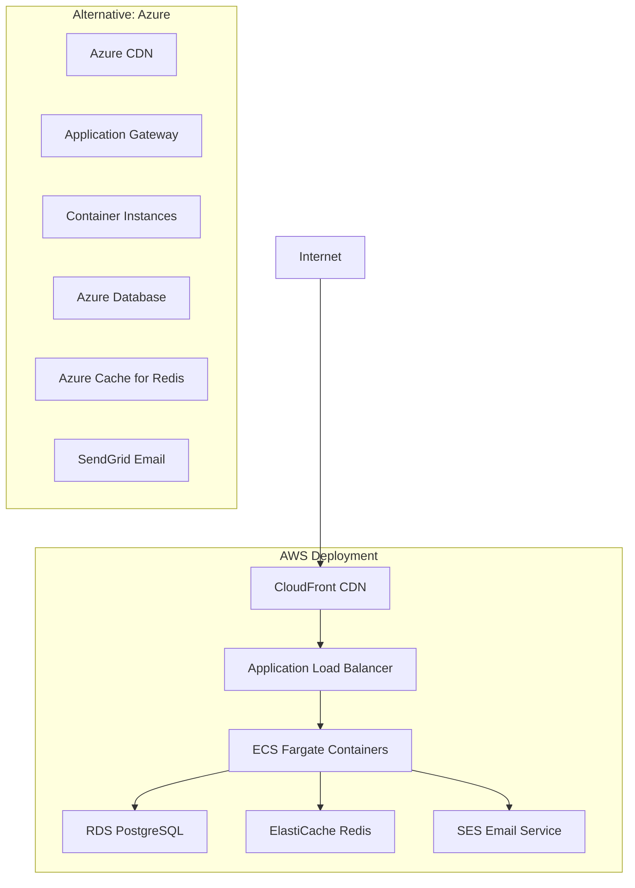

### Docker Configuration
```dockerfile
# Multi-stage build for production
FROM node:18-alpine AS builder
WORKDIR /app
COPY package*.json ./
RUN npm ci --only=production

FROM node:18-alpine AS runtime
WORKDIR /app
COPY --from=builder /app/node_modules ./node_modules
COPY . .
EXPOSE 3000
HEALTHCHECK --interval=30s --timeout=3s --start-period=5s --retries=3 \
  CMD curl -f http://localhost:3000/health || exit 1
CMD ["npm", "start"]
```

### Kubernetes Deployment
```yaml
apiVersion: apps/v1
kind: Deployment
metadata:
  name: agentcare-api
spec:
  replicas: 3
  selector:
    matchLabels:
      app: agentcare-api
  template:
    metadata:
      labels:
        app: agentcare-api
    spec:
      containers:
      - name: agentcare-api
        image: agentcare/api:latest
        ports:
        - containerPort: 3000
        env:
        - name: DATABASE_URL
          valueFrom:
            secretKeyRef:
              name: agentcare-secrets
              key: database-url
        resources:
          requests:
            memory: "256Mi"
            cpu: "250m"
          limits:
            memory: "512Mi"
            cpu: "500m"
```

## 📊 Monitoring & Observability

### Monitoring Stack
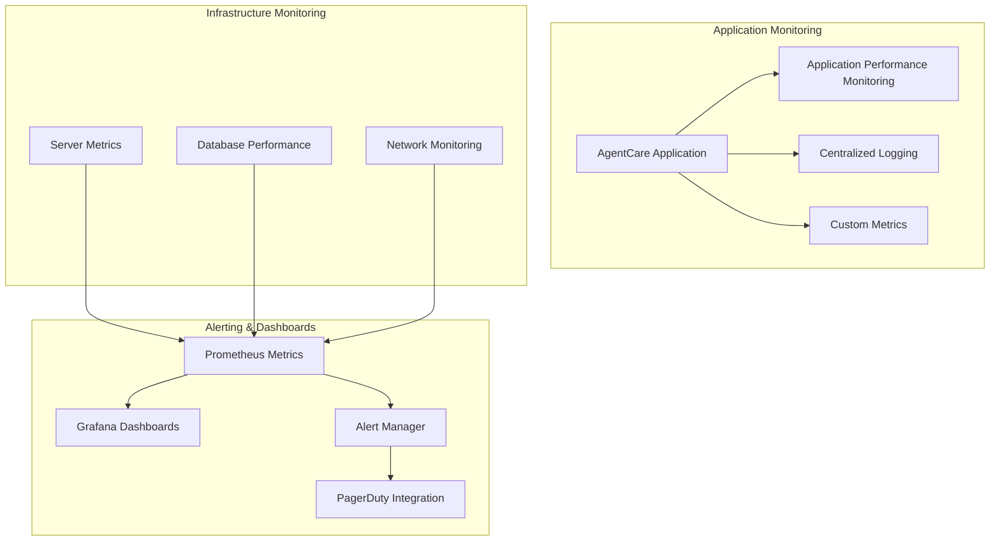

### Key Metrics to Monitor
- **Agent Performance**: Response times, success rates, coordination efficiency
- **System Health**: CPU usage, memory consumption, error rates
- **Business Metrics**: Appointments booked, cancellation rates, user satisfaction
- **User Experience**: Page load times, conversion rates, task completion

## 📈 Development Phases

### Phase 1: Foundation (Weeks 1-3)
**Priority**: Critical
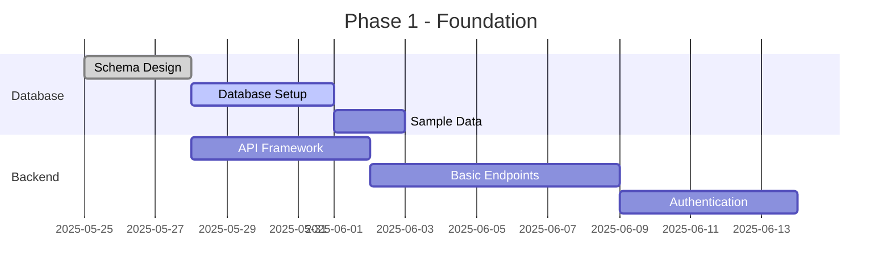

**Deliverables**:
- [ ] PostgreSQL database with complete schema
- [ ] RESTful API with core endpoints
- [ ] Basic authentication system
- [ ] Docker containerization
- [ ] Unit test framework setup

### Phase 2: Core Features (Weeks 4-7)
**Priority**: High
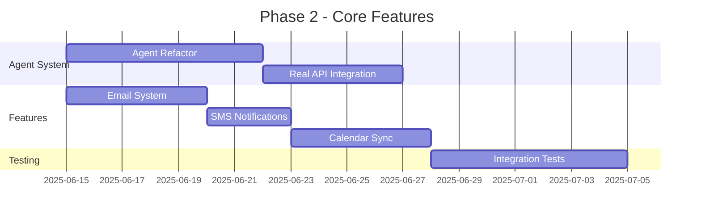

**Deliverables**:
- [ ] Complete agent coordination system
- [ ] Email and SMS notifications
- [ ] Calendar integration (Google, Outlook)
- [ ] Comprehensive integration tests
- [ ] API documentation

### Phase 3: Advanced Features (Weeks 8-12)
**Priority**: Medium
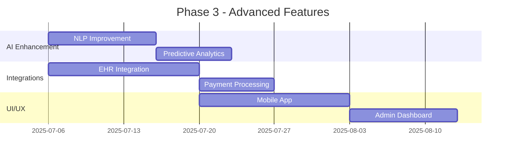

**Deliverables**:
- [ ] Enhanced NLP capabilities
- [ ] Predictive scheduling analytics
- [ ] EHR system integration
- [ ] Payment processing
- [ ] Mobile application
- [ ] Administrative dashboard

### Phase 4: Production Launch (Weeks 13-16)
**Priority**: Critical
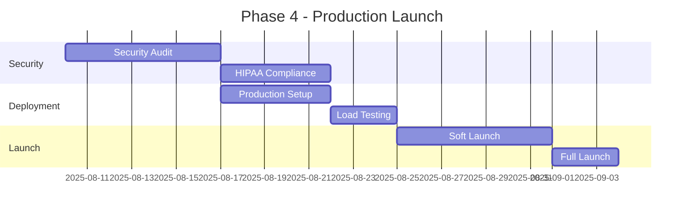

**Deliverables**:
- [ ] Security audit completion
- [ ] HIPAA compliance certification
- [ ] Production environment setup
- [ ] Performance optimization
- [ ] Launch readiness review

## 🛠️ Technology Stack Recommendations

### Frontend Stack
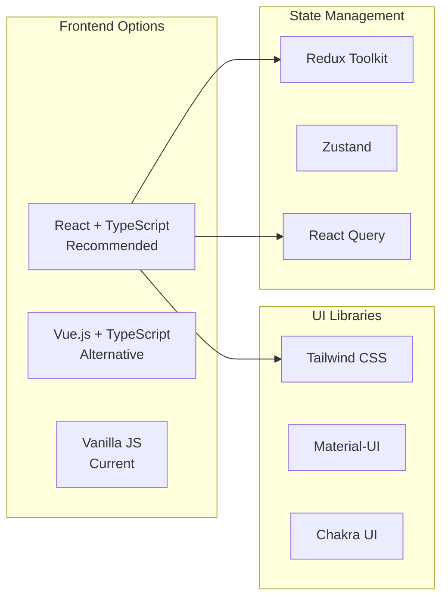

### Backend Stack
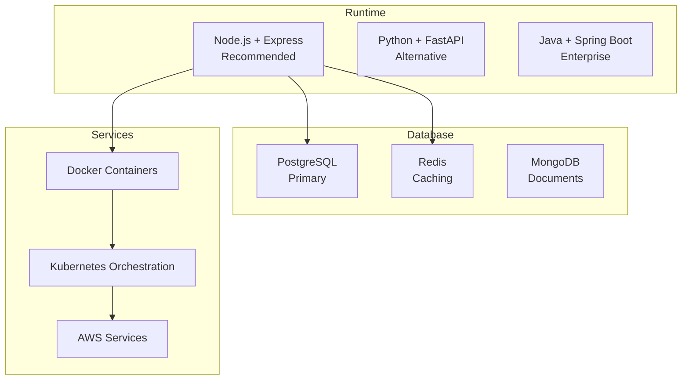

## 🔍 Performance Benchmarks

### Current Performance (Demo Version)
- **Initial Load**: < 2 seconds
- **Agent Response**: 1-3 seconds (simulated)
- **Memory Usage**: < 50MB
- **Bundle Size**: ~100KB

### Production Targets
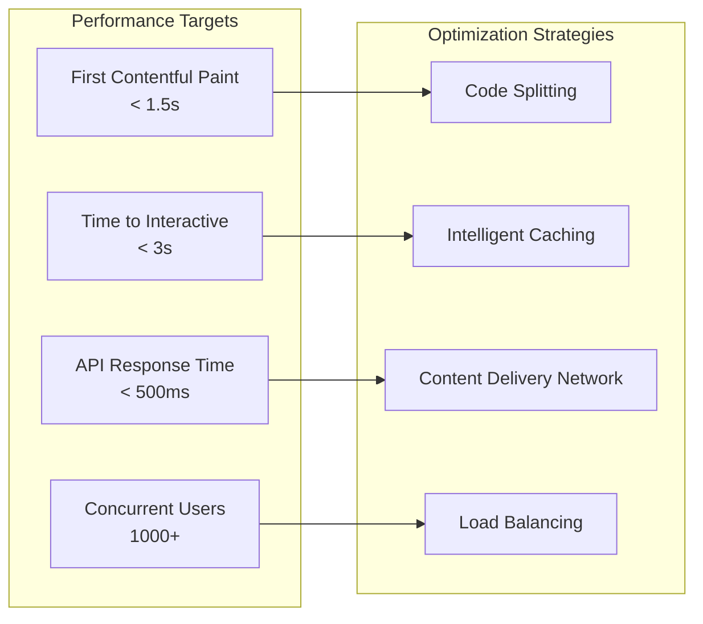

## 📋 Contributing Guidelines

### Development Workflow
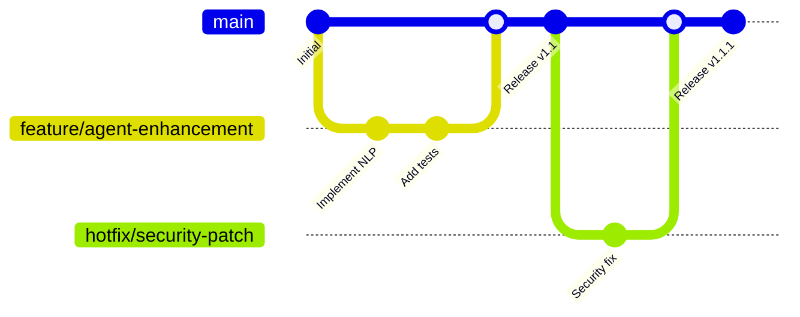

### Code Standards
- **Language**: TypeScript preferred, JavaScript acceptable
- **Style**: Prettier + ESLint configuration
- **Testing**: Minimum 80% code coverage
- **Documentation**: JSDoc comments for all public functions
- **Git**: Conventional commits (feat, fix, docs, etc.)

### Pull Request Process
1. Create feature branch from `main`
2. Implement changes with tests
3. Update documentation
4. Ensure CI passes
5. Request code review
6. Address feedback
7. Merge after approval

## 📞 Project Structure

```
agentcare/
├── README.md                          # This file
├── LICENSE                           # MIT License
├── package.json                      # Node.js dependencies
├── docker-compose.yml                # Development environment
├── .github/
│   ├── workflows/                    # CI/CD pipelines
│   └── ISSUE_TEMPLATE/              # Issue templates
├── docs/
│   ├── api-reference.md             # API documentation
│   ├── deployment-guide.md          # Deployment instructions
│   └── architecture.md              # Detailed architecture
├── frontend/
│   ├── public/
│   │   └── index.html              # Current demo version
│   ├── src/
│   │   ├── components/             # React components
│   │   ├── agents/                 # Agent implementations
│   │   ├── services/               # API services
│   │   └── utils/                  # Utility functions
│   └── tests/                      # Frontend tests
├── backend/
│   ├── src/
│   │   ├── controllers/            # API controllers
│   │   ├── models/                 # Database models
│   │   ├── services/               # Business logic
│   │   ├── middleware/             # Express middleware
│   │   └── utils/                  # Backend utilities
│   ├── tests/                      # Backend tests
│   └── migrations/                 # Database migrations
├── database/
│   ├── schema.sql                  # Database schema
│   ├── seeds/                      # Sample data
│   └── migrations/                 # Schema changes
└── infrastructure/
    ├── docker/                     # Docker configurations
    ├── kubernetes/                 # K8s manifests
    └── terraform/                  # Infrastructure as code
```

## 🎯 Success Metrics & KPIs

### Technical Metrics
- **System Uptime**: > 99.9%
- **API Response Time**: < 500ms (95th percentile)
- **Error Rate**: < 0.1%
- **Agent Coordination Efficiency**: > 95% successful delegations

### Business Metrics  
- **Appointment Booking Conversion**: > 80%
- **User Satisfaction Score**: > 4.5/5
- **Cancellation Rate**: < 10%
- **System Adoption Rate**: Track monthly active users

### User Experience Metrics
- **Task Completion Rate**: > 90%
- **Average Session Duration**: Optimal range 3-7 minutes
- **User Return Rate**: > 60% within 30 days
- **Support Ticket Reduction**: 50% decrease in booking-related issues

## 🚀 Getting Started Checklist

### Immediate Next Steps (Week 1)
- [ ] Clone repository and set up development environment
- [ ] Choose and set up database (PostgreSQL recommended)
- [ ] Initialize backend framework (Node.js + Express recommended)
- [ ] Set up basic CI/CD pipeline
- [ ] Create first API endpoint

### Short-term Goals (Month 1)
- [ ] Complete database schema implementation
- [ ] Build all core API endpoints
- [ ] Implement authentication system
- [ ] Set up automated testing
- [ ] Deploy development environment

### Medium-term Goals (Month 2-3)
- [ ] Integrate real agent coordination
- [ ] Add email notification system
- [ ] Implement appointment management features
- [ ] Create admin dashboard
- [ ] Perform security audit

### Long-term Goals (Month 4+)
- [ ] Launch beta version
- [ ] Implement advanced AI features
- [ ] Add mobile application
- [ ] Scale for production use
- [ ] Achieve HIPAA compliance

---

## 📝 License

MIT License - see [LICENSE](LICENSE) file for details.

## 🤝 Contributing

We welcome contributions! Please see our [Contributing Guidelines](CONTRIBUTING.md) for details.

## 📧 Support

- **Documentation**: [docs.agentcare.dev](https://docs.agentcare.dev)
- **Issues**: [GitHub Issues](https://github.com/vishalm/agentcare/issues)
- **Discussions**: [GitHub Discussions](https://github.com/vishalm/agentcare/discussions)
- **Email**: contact@agentcare.dev

---

**Ready to build the future of healthcare scheduling?** Start with Phase 1 and follow this comprehensive roadmap to create a production-ready AgentCare system. 🚀